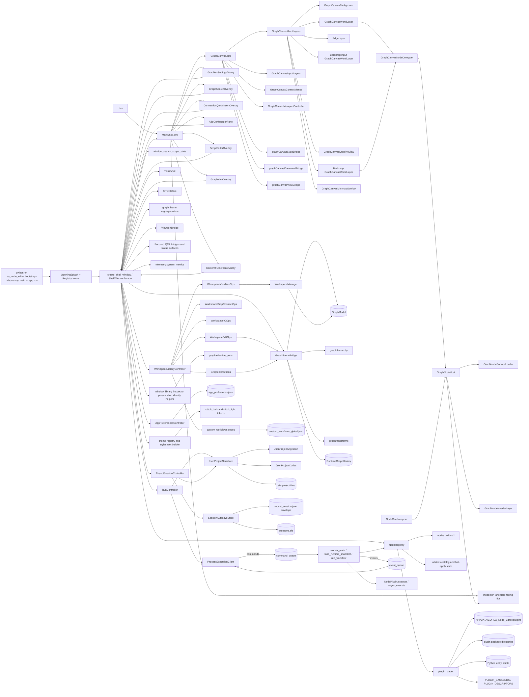
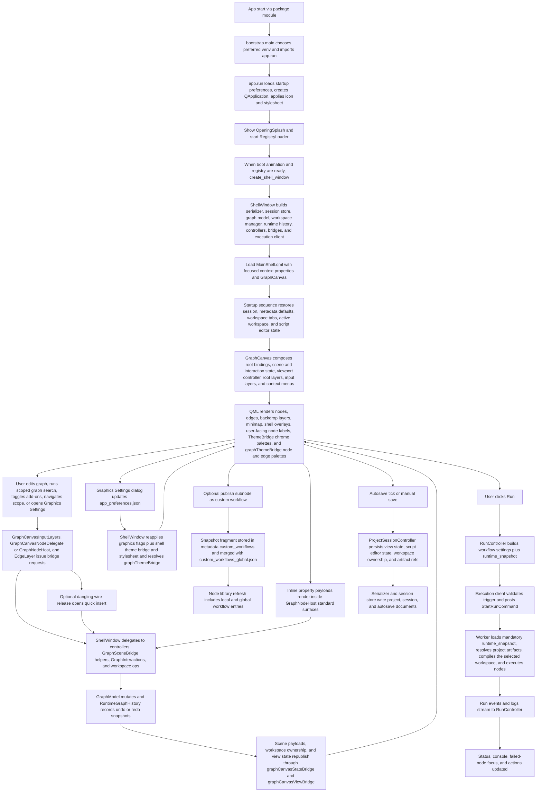
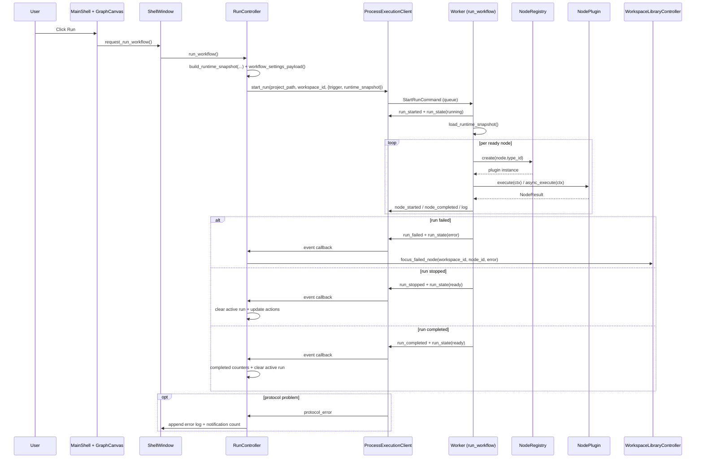

# COREX Node Editor Architecture (Plain English)

## Purpose of this document
This file explains how COREX Node Editor is structured, how runtime data moves through the app, and where to make changes safely.
It is a practical map for engineers working in this repository.

## UI packet entry path
Before changing packet-owned UI seams:
- for pre-packet feature planning, start from the portable [plan template](PLANS_TO_IMPLEMENT/PLAN_TEMPLATE.md) and then apply this repo's [planning overlay](PLANS_TO_IMPLEMENT/PLAN_REPO_OVERLAY.md);
- use the repo overlay as the entry point for local packet indexes, packet templates, verification defaults, and ownership rules before expanding packet-owned UI seams; and
- keep one primary source owner and one primary regression owner when work crosses subsystems instead of reopening omnibus files, stable regression entrypoints, or raw host globals.

## What this app does
COREX Node Editor is a desktop visual workflow editor that:
- lets users build node graphs on a QML canvas,
- supports passive visual authoring families for flowcharts, planning boards, annotations, and local media panels on the same canvas,
- supports nested subnode scopes (graph hierarchy),
- executes workflows in a separate worker process,
- persists projects as versioned `.sfe` JSON with optional sibling `.data` managed-file sidecars,
- persists app-wide graphics, shell-theme, and graph-theme preferences as versioned `app_preferences.json`,
- supports plugin-based custom node types,
- publishes/imports reusable custom workflow snapshots and merges project-local plus user-global workflow libraries,
- restores sessions/autosaves and reports runtime status/metrics.

## Big picture
The app is split into clear parts:

- `ea_node_editor/ui` + `ea_node_editor/ui_qml`: shell window, QML shell/canvas composition, bridges, and UI models.
- `ea_node_editor/ui/shell/controllers`: orchestration split into app-preferences, run, project/session, and workspace/library controllers.
- `ea_node_editor/ui/theme`: shared theme registry, token sets, QWidget stylesheet generation, and QML palette bridge inputs.
- `ea_node_editor/ui/graph_theme`: graph-theme registry, token sets, runtime resolution, and node/edge presentation helpers.
- `ea_node_editor/graph`: in-memory graph domain (`ProjectData`, `WorkspaceData`, nodes, edges, views), hierarchy helpers, and graph transforms.
- `ea_node_editor/addons`: repo-local add-on catalog, enablement state, and hot-apply lifecycle.
- `ea_node_editor/nodes`: node SDK contracts, registry, built-ins, descriptor-only plugin discovery, and package import/export.
- `ea_node_editor/execution`: runtime-snapshot assembly, UI client, worker process, and typed command/event protocol.
- `ea_node_editor/persistence`: current-schema validation, overlay/artifact codecs, serializer, and session/autosave storage.
- `ea_node_editor/custom_workflows`: project-local metadata codec, user-global library store, and `.eawf` import/export.
- `ea_node_editor/workspace`: workspace ordering, metadata ownership normalization, and lifecycle manager.
- `ea_node_editor/telemetry`: system metrics.

Design intent:
- QML renders and captures interaction.
- `GraphCanvas.qml` composes focused root/state/controller modules (`GraphCanvasRootBindings`, `GraphCanvasInteractionState`, `GraphCanvasSceneState`, `GraphCanvasNodeSurfaceBridge`, `GraphCanvasViewportController`, `GraphCanvasSceneLifecycle`, `GraphCanvasRootLayers`, `GraphCanvasInputLayers`, `GraphCanvasContextMenus`).
- `GraphCanvasRootLayers.qml` owns the live background, backdrop, edge, drop-preview, node-world, toolbar, and minimap layering instead of keeping that list inline in `GraphCanvas.qml`.
- `GraphCanvasWorldLayer.qml` repeats `GraphCanvasNodeDelegate.qml`, which hosts `GraphNodeHost.qml`; `NodeCard.qml` is now the standard-surface wrapper rather than the active canvas delegate.
- `GraphScenePayloadBuilder` separates `comment_backdrop` payloads into `backdrop_nodes_model`, and `GraphCanvas.qml` renders that model on a dedicated layer below `graphCanvasEdgeLayer` and the regular node repeater so grouping surfaces stay visually behind ordinary nodes and note-style annotations.
- Comment backdrops render as paired main and input-overlay delegates, and `GraphCanvasNodeDelegate.qml` mirrors live geometry into both hosts so resize and drag feedback stay synchronized during interaction.
- `GraphNodeHost.qml` keeps node-body drag/select/open/context behavior below the loaded surface content, and graph surfaces publish local ownership through `embeddedInteractiveRects` instead of relying on click-swallowing top overlays.
- `GraphNodeHeaderLayer.qml` owns the single shared inline title editor for standard cards, passive surfaces, collapsed nodes, and scope-capable shells; `GraphCanvas.qml` routes header title commits back onto the existing rename/mutation-history authority instead of introducing a surface-local title workflow.
- Shell overlays remain shell-owned in `MainShell.qml`; `GraphSearchOverlay`, `ConnectionQuickInsertOverlay`, `AddOnManagerPane`, `ScriptEditorOverlay`, `GraphHintOverlay`, and `ContentFullscreenOverlay` are siblings rather than canvas-local widgets.
- `ShellWindow` is a thin facade that delegates to controllers and bridge helpers.
- App-wide graphics settings live in `app_preferences.json` through `AppPreferencesController`, not in project `.sfe` metadata or `last_session.json`.
- Shared shell-theme resolution feeds both the QApplication stylesheet and QML `ThemeBridge.palette`, so shell and canvas chrome surfaces switch themes together at runtime.
- Dedicated graph-theme resolution feeds QML `graphThemeBridge`, so graph item surfaces (`GraphNodeHost`/`NodeCard`, `EdgeLayer`, category accents, and port-kind rendering) can follow the shell theme by default or switch to explicit/custom graph themes without changing canvas chrome.
- User-facing shell surfaces prefer node titles and per-type sequential IDs; raw internal `node_id` values stay as internal references.
- `GraphModel` remains the canonical mutable graph state for both runtime nodes and passive visual nodes; passive items stay under `WorkspaceData.nodes` / `WorkspaceData.edges` instead of introducing a second artifact store.
- Passive `flow` edges are graph-authoring artifacts only: they support labels, branch styling, and multi-incoming targets where the registry allows it, but the compiler/worker drop them before runtime execution.
- Hierarchy is explicit via `NodeInstance.parent_node_id` and per-view `scope_path`.
- Undo/redo is managed by `RuntimeGraphHistory` snapshots.
- Packet-owned runs build `RuntimeSnapshot` payloads before crossing into the worker process; `project_path` is retained only as artifact-resolution context.
- Serializer/current-schema validation keeps persisted projects deterministic at `SCHEMA_VERSION = 3`, including passive visual metadata and project-local `metadata.ui.passive_style_presets`; pre-current documents require an offline conversion before load.

## Shell/scene boundary ownership

- `MainShell.qml` remains the composition root for shell chrome and shell-owned overlays, but packet-owned QML now binds to focused bridges instead of raw host globals.
- `shellLibraryBridge` owns library search/filter state, graph-search results, quick-insert candidates, and hint/insert shell overlays for QML consumers.
- `shellWorkspaceBridge` owns workspace tabs, title/run/console state, and other shell-chrome workflows that belong to the main shell rather than the scene bridge.
- `shellInspectorBridge` owns inspector-facing selection metadata, property-edit affordances, and exposed-port presentation for inspector QML surfaces.
- `addonManagerBridge`, `contentFullscreenBridge`, `viewerSessionBridge`, `viewerHostService`, `scriptEditorBridge`, `scriptHighlighterBridge`, `statusEngine`, `statusJobs`, `statusMetrics`, `statusNotifications`, and `helpBridge` are all first-class shell-owned context surfaces now bound from `ea_node_editor.ui.shell.composition`.
- `graphCanvasStateBridge` owns the scene payloads, selection lookup, execution overlays, and graphics flags consumed by `GraphCanvas.qml`.
- `graphCanvasViewBridge` (the `ViewportBridge` context property) owns camera/view state consumed directly by `GraphCanvas.qml` and `GraphCanvasRootLayers.qml`.
- `graphCanvasCommandBridge` owns scene/view mutations, scope-open/property-browse requests, drop/connect flows, and connection quick-insert requests flowing back into `ShellWindow`.
- `GraphCanvas.qml` still exposes the stable root contract methods used by shell/drop workflows (`toggleMinimapExpanded()`, `clearLibraryDropPreview()`, `updateLibraryDropPreview()`, `isPointInCanvas()`, `performLibraryDrop()`).
- `ShellWindow.graph_canvas_bridge` is a host-only edge adapter for construction and test seams. Packet-owned QML receives focused state, command, view, and action bridges directly instead of an aggregate canvas context property.
- `GraphSceneBridge` remains the stable public scene contract for node/edge payloads and QML-invokable scene slots, but internal responsibility is split behind helper seams in `GraphSceneScopeSelection`, `GraphSceneMutationHistory`, and `GraphScenePayloadBuilder`.
- `ThemeBridge` continues to own shell/canvas chrome tokens, while `graphThemeBridge` owns node/edge theming so shell-theme and graph-theme responsibilities stay separate.
- Packet-owned QML should bind to the focused bridges above rather than introducing new raw host globals or reviving retired compatibility context properties.

## Graph action entry-point ownership

- The canonical high-level graph action route is `shortcut/menu/QML event -> GraphActionBridge or PyQt action dispatch -> GraphActionController -> existing behavior owner`.
- `GraphActionController` is the single coordinator for user-facing graph verbs such as copy, cut, paste, duplicate, delete, grouping, alignment, scope navigation, comment-backdrop wrapping, node style commands, node rename/help, custom workflow publishing, comment peek, and flow-edge style or removal commands.
- QML context-menu and node-delegate actions call `graphActionBridge.trigger_graph_action(actionId, payload)`. The bridge maps stable QML action IDs through `ea_node_editor.ui.shell.graph_action_contracts` and delegates to `GraphActionController`.
- PyQt menus, shortcuts, and host request slots dispatch through `ea_node_editor.ui.shell.window_actions` and `ea_node_editor.ui.shell.window_state.workspace_graph_actions`, then converge on the same controller instead of carrying parallel behavior.
- `GraphActionController` does not own the behavior implementation. It selects the established owner for each verb: workspace graph-edit controllers for selection/subgraph operations, graph canvas presenters for scope entry and host actions, `GraphSceneBridge` for comment-peek state, and the help or add-on bridges for their shell-owned surfaces.
- Low-level canvas operations stay outside the graph action controller. Selection mechanics, marquee hit testing, node movement, node resize, geometry commits, viewport pan/zoom, port drag/connect/drop flows, inline property and port-label commits, cursor-shape changes, quick-insert overlay placement, and direct scene policy checks continue to live in `GraphCanvasCommandBridge`, `GraphCanvasStateBridge`, `ViewportBridge`, `GraphSceneBridge`, and their helper modules.
- `docs/specs/perf/COREX_ARCHITECTURE_ENTRY_POINT_REDUCTION_QA_MATRIX.md` is retained as historical graph-action-route evidence; the active no-legacy closeout proof lives in `docs/specs/perf/COREX_NO_LEGACY_ARCHITECTURE_CLEANUP_QA_MATRIX.md`.

## Passive visual authoring path

- Passive nodes use the same registry and serializer path as executable nodes, but `NodeTypeSpec.runtime_behavior` marks them as `passive` so they never compile into the worker graph.
- `PortKind.flow` is the authoring-only connection kind for passive diagrams. `flow` edges remain visible, labeled, and styleable in the scene, but they do not affect Run.
- Surface routing is declarative through `surface_family` / `surface_variant`, which keeps public QML discoverability stable while letting the graph host swap between standard cards, flowchart silhouettes, planning cards, annotation notes, comment backdrops, and media panels.
- Passive style editing is project-local. Node and flow-edge presets are stored under `metadata.ui.passive_style_presets` inside the `.sfe` document rather than in app-wide preferences.
- Media panels resolve local filesystem sources only. Image panels display local image files, and PDF panels render a single-page QtPdf preview through the Python-side preview provider.

## Comment backdrop grouping path

- Comment backdrops are a dedicated passive surface family and zero-port node type that stays distinct from the existing connectable annotation cards. The shell can place them from the library or wrap the current selection via shortcut `C`, while `Ctrl+G` and `Ctrl+Shift+G` remain reserved for structural subnode grouping.
- Membership is derived from geometry rather than persisted member lists: the smallest fully containing backdrop in the same scope and parent chain owns a node or nested backdrop, which drives nesting, descendant drag/resize propagation, collapse-driven descendant hiding, boundary-edge rerouting, and the expanded-versus-collapsed clipboard/delete rules.
- Serializer and clipboard fragment paths persist only authored backdrop state such as title, body, collapsed flag, and geometry. Derived containment metadata is stripped and recomputed on paste and load.

## Passive flowchart neutral-port contract

- Passive visual built-ins now store exactly four logical-flow ports with keys `top`, `right`, `bottom`, and `left`; each port is `direction="neutral"`, `kind="flow"`, `data_type="flow"`, `allow_multiple_connections=True`, and publishes a matching cardinal `side`.
- Persisted passive flow edges keep those stored cardinal keys in `source_port_key` and `target_port_key`. Legacy `flow_in`, `flow_out`, `branch_a`, and `branch_b` identities are retired; branch meaning now lives on edge labels and edge styling.
- Graph-scene and QML interaction payloads carry the same cardinal metadata. When a gesture starts from a passive neutral flow port, the live payload publishes `origin_side`, and when both endpoints are passive neutral flow ports the first selected or dragged port is authoritative as the source.
- Flowchart node surfaces anchor those four handles on the exact silhouette perimeter at the referenced cardinal side, while other passive node families anchor the same handles on their rectangular top/right/bottom/left edges. Passive logical-flow surfaces and drop previews keep raw port labels hidden instead of falling back to fixed `in` / `out` port rows.

## Graph-surface input routing

- `GraphNodeHost.qml` owns node-body gestures, but those handlers now live under the loaded surface content so graph surfaces can keep normal body drag/select/open/context behavior without sitting behind a drag-swallowing overlay.
- `GraphNodeSurfaceLoader.qml` forwards two distinct contracts from loaded surfaces:
  - `embeddedInteractiveRects` for ordinary buttons, editors, and handles that need local pointer ownership in host-local coordinates.
  - `blocksHostInteraction` for whole-surface modal tools such as crop mode.
- `embeddedInteractiveRects` is the default contract for interactive graph-surface controls. `blocksHostInteraction` is intentionally narrower and should not be used as a blanket substitute for local hit testing.
- Reusable graph-surface controls live under `ea_node_editor/ui_qml/components/graph/surface_controls/`; new interactive surfaces should reuse that kit before introducing one-off button or field implementations.
- Hover-only affordances use `HoverHandler` or `MouseArea { acceptedButtons: Qt.NoButton }`. Do not reintroduce invisible click-swallowing overlays or compatibility-only hover proxies.
- Graph-surface editors commit and browse by explicit `nodeId` bridge calls so surface editing does not depend on selected-node timing in the inspector path.

## Shared inline title workflow

- `GraphNodeHeaderLayer.qml` owns the only approved inline title editor (`graphNodeTitleEditor`). Standard executable nodes, passive families, collapsed nodes, and scope-capable shells all reuse that header editor rather than adding per-surface title controls.
- Inline header commits converge on the existing title-mutation authority. `GraphCanvas.qml` forwards the edit as a title change, and the mutation layer applies `set_node_title(...)` semantics so property-backed passive families keep `node.title` plus `properties["title"]` synchronized while standard/media/subnode nodes update only the canonical node title.
- Scope-capable subnode shells keep a dedicated `OPEN` badge in the shared header. Title double-click is edit-only; badge activation commits any in-flight title edit and then reuses `GraphCanvas.requestOpenSubnodeScope(...)` for scope entry.

## ARCH_SIXTH_PASS closure snapshot

- Startup entry, app-preferences loading, and the performance harness now land on explicit package seams: `ea_node_editor.bootstrap`, `ea_node_editor.app_preferences`, and `ea_node_editor.ui.perf.performance_harness` own the packet-owned startup path rather than UI-host glue.
- Startup now runs as `python -m ea_node_editor.bootstrap` or the `corex-node-editor` console command -> `ea_node_editor.bootstrap.main()` -> `ea_node_editor.app.run()`, with preferred-venv re-exec plus `OpeningSplash` and `RegistryLoader` gating `create_shell_window()`.
- Shell construction now runs through `ea_node_editor.ui.shell.composition`, with `ShellWindow` acting as the host/facade while focused library, navigation, graph-edit, package-IO, run, session, and preferences controllers carry packet-owned orchestration.
- Packet-owned QML now consumes `shellLibraryBridge`, `shellWorkspaceBridge`, `shellInspectorBridge`, `addonManagerBridge`, `graphCanvasStateBridge`, `graphCanvasCommandBridge`, `graphCanvasViewBridge`, `contentFullscreenBridge`, `viewerSessionBridge`, `viewerHostService`, `scriptEditorBridge`, `scriptHighlighterBridge`, `themeBridge`, `graphThemeBridge`, `uiIcons`, `statusEngine`, `statusJobs`, `statusMetrics`, `statusNotifications`, and `helpBridge` as the primary context surface.
- Packet-owned graph authoring writes now route through the authoritative mutation-service path, and runtime history captures the mutable workspace state needed for undo/redo without leaving payload normalization as a live-model side effect.
- Persistence-only overlay ownership now lives under `ea_node_editor.persistence.overlay`, current-schema `.sfe` documents stay stable, and pre-current-schema documents are intentionally rejected on this branch rather than silently converting inside the app.
- Packet-owned run flows now build and submit `RuntimeSnapshot` payloads only; `project_doc` is rejected at the client/protocol boundary, and the worker requires a snapshot while using `project_path` only for artifact context.
- Plugin loading supports `PLUGIN_BACKENDS`, `PLUGIN_DESCRIPTORS`, package-directory discovery, and entry-point loading with provenance-aware validation. Constructor fallback and class scanning are no longer current plugin contracts.
- Oversized regression suites are split into focused modules, and `scripts/verification_manifest.py` is the canonical source for verification modes, shell-isolation catalogs, target-id prefixes, ownership specs, shell-direct unittest rerun commands, and proof-audit anchors consumed by the runner, checker, tests, and packet-owned docs.

## Current focused contracts

- Focused bridges are the QML source contract: shell, graph-canvas state, graph-canvas commands, viewport, graph actions, add-on manager, content fullscreen, viewer session/host, script, theme, status, and help surfaces are exported explicitly from `ea_node_editor.ui.shell.composition`.
- Persistence is current-schema-only for ordinary app load. The serializer normalizes `SCHEMA_VERSION = 3` documents and rejects older schema versions rather than keeping in-app migration hooks active.
- Plugin and add-on loading is descriptor-only: current modules publish `PLUGIN_DESCRIPTORS`, `PLUGIN_BACKENDS`, package descriptors, entry-point descriptors, or repo-local add-on records with provenance.
- Runtime execution uses snapshot-only worker payloads. `RuntimeSnapshot` is mandatory at the protocol boundary; `project_path` remains artifact-resolution context, not a rebuild source.
- Viewer state crosses process and UI boundaries through typed transport/session fields (`backend_id`, `transport`, `transport_revision`, live-open status, and blocker state). Raw DPF/PyVista/VTK objects stay worker-local or widget-local.
- Launch, package imports, and performance harness entry points use canonical package paths: `ea_node_editor.bootstrap`, `ea_node_editor.app`, `ea_node_editor.ui.perf.performance_harness`, and explicit package modules instead of root launch/import shims.
- The clean-architecture restructure is closed on explicit owners: passive runtime contracts in `execution.runtime_contracts`, graph mutations in graph-owned domain APIs, workspace/custom-workflow identity in `workspace` and `custom_workflows`, current-schema persistence in `persistence`, shell composition in `ea_node_editor.ui.shell.composition`, QML shell/canvas ports in focused bridge modules, node descriptors in `nodes` plus `addons`, and theme/status services in their presentation layers.
- Historical packet matrices remain useful archive evidence for earlier cleanup waves, but `docs/specs/perf/COREX_NO_LEGACY_ARCHITECTURE_CLEANUP_QA_MATRIX.md` is the active no-legacy architecture closeout baseline.
- `docs/specs/perf/COREX_CLEAN_ARCHITECTURE_RESTRUCTURE_QA_MATRIX.md` is the active P01-P12 clean-architecture restructure closeout baseline for accepted packet branches, substantive commits, retained verification, artifacts, and residual risks.
- Shell-backed regression suites still require fresh-process execution because repeated Windows Qt/QML `ShellWindow()` construction is not yet reliable in one interpreter process.

## Add-on backend preparation

- `ea_node_editor.addons.catalog`, `ea_node_editor.nodes.plugin_contracts.py`, and `ea_node_editor.nodes.plugin_loader.py` now define the generic add-on record, dependency metadata, one-policy apply model (`hot_apply` or `restart_required`), and persisted enabled or pending-restart state used by the repo-local add-on catalog.
- The shell `Add-On Manager` entry now runs through `ea_node_editor.ui.shell.window_actions.py`, `ea_node_editor.ui.shell.window.py`, `ea_node_editor.ui.shell.presenters.addon_manager_presenter.py`, `ea_node_editor.ui_qml/shell_addon_manager_bridge.py`, and `MainShell.qml`, landing the shipped Variant 4 inspector-style right drawer with row-level `HOT`/`RESTART` badges, pending-restart banners, and explicit but still-disabled install/restart affordances.
- `ea_node_editor/persistence/project_codec.py`, `ea_node_editor/graph/normalization.py`, `ea_node_editor/ui_qml/graph_scene_payload_builder.py`, `ea_node_editor/ui_qml/components/graph/GraphNodeHost.qml`, `GraphNodeHeaderLayer.qml`, and `GraphCanvasContextMenus.qml` project unavailable add-on nodes as locked Mockup B surfaces with manager-targeted recovery affordances and blocked edit, drag, and resize gestures.
- `ea_node_editor/addons/ansys_dpf/catalog.py`, `ea_node_editor/addons/hot_apply.py`, `ea_node_editor/execution/worker_services.py`, and `ea_node_editor/ui_qml/viewer_host_service.py` make ANSYS DPF the first repo-local `hot_apply` add-on and rebuild registry/runtime state, invalidate viewer/worker caches, and project unavailable live nodes back into locked unavailable-add-on surfaces when its enabled state changes.
- The retained packet evidence and closeout commands for this baseline are published in [the Add-On Manager backend preparation QA matrix](docs/specs/perf/ADDON_MANAGER_BACKEND_PREPARATION_QA_MATRIX.md).

## DPF operator backend preparation

- `ansys-dpf-core` remains optional for the DPF operator backend preparation baseline; startup without that dependency keeps the rest of the app usable.
- The frozen preparation contract is documented in [the DPF operator backend review](docs/DPF_OPERATOR_PLUGIN_BACKEND_REVIEW_2026-04-12.md) and [the DPF operator backend QA matrix](docs/specs/perf/DPF_OPERATOR_PLUGIN_BACKEND_REFACTOR_QA_MATRIX.md).
- Reopened DPF nodes without their add-on/backend dependency stay as locked unavailable-add-on projections so saved labels, values, exposure metadata, and connectivity remain inspectable without executing unavailable operators.

## DPF plugin rollout

- `ansys-dpf-core` remains optional. The node bootstrap and plugin loader only register the shipped DPF family when the dependency is available, so startup without DPF keeps the rest of the app usable.
- The shipped DPF catalog is workflow-first and descriptor-driven. Foundational helpers and inputs live under `Ansys DPF > Inputs`, `Ansys DPF > Workflow`, and `Ansys DPF > Helpers > ...`, generated operator wrappers live under `Ansys DPF > Operators > <Family>`, and `dpf.viewer` remains under `Ansys DPF > Viewer`.
- Built-in DPF registration is version-aware. Startup records the installed `ansys-dpf-core` version, refreshes the shipped descriptor cache when that version changes, and keeps descriptor-first provenance-aware package validation as the primary lifecycle path.
- `ea_node_editor/nodes/builtins/ansys_dpf_catalog.py`, `ansys_dpf_taxonomy.py`, `ansys_dpf_operator_catalog.py`, `ansys_dpf_helper_catalog.py`, and `ansys_dpf_common.py` normalize foundational helpers plus generated operator families into stable node, port, and pin-source descriptors that distinguish required inputs, optional inputs, omitted defaults, literal values, mutually exclusive groups, source paths, and family provenance.
- `ea_node_editor/execution/dpf_runtime/base.py`, `contracts.py`, and `operations.py` are the generic operator-backed runtime seam for the shipped DPF compute surface; they now materialize helper-originated model, scoping, mesh, fields-container, and generic object handles while preserving the existing handwritten `dpf.field_ops` passthrough edge case.
- `ea_node_editor/persistence/project_codec.py`, `ea_node_editor/graph/normalization.py`, and `ea_node_editor/ui_qml/graph_scene_payload_builder.py` project reopened `dpf.*` nodes as locked unavailable-add-on surfaces with saved labels, values, exposure metadata, and connectivity.
- The earlier backend-preparation contract remains frozen in [the DPF operator backend review](docs/DPF_OPERATOR_PLUGIN_BACKEND_REVIEW_2026-04-12.md) and [the DPF operator backend QA matrix](docs/specs/perf/DPF_OPERATOR_PLUGIN_BACKEND_REFACTOR_QA_MATRIX.md). That frozen preparation wording still includes the historical fact that "Broad autogenerated operator rollout and non-operator `ansys.dpf.core` reflection remain deferred". The shipped rollout proof now lives in [the ANSYS DPF full plugin rollout QA matrix](docs/specs/perf/ANSYS_DPF_FULL_PLUGIN_ROLLOUT_QA_MATRIX.md), while the generic add-on-manager, locked-projection, and DPF toggle baseline that owns the repo-local lifecycle is summarized in [the Add-On Manager backend preparation QA matrix](docs/specs/perf/ADDON_MANAGER_BACKEND_PREPARATION_QA_MATRIX.md). On the shipped rollout, only the broad `Ansys DPF > Advanced > Raw API Mirror` / non-operator `ansys.dpf.core` reflection surface remains deferred to a later packet set.

## Project-managed files and stored outputs

- `.sfe` remains the canonical project document. Saved projects can add a sibling `<project-stem>.data/` sidecar that holds managed `assets/`, generated `artifacts/`, and hidden `.staging/` scratch plus `.staging/recovery`.
- `metadata.artifact_store` is additive only. Existing project/node fields stay ordinary JSON values, but file-bearing properties may store `artifact://<artifact_id>` or `artifact-stage://<artifact_id>` strings instead of raw absolute paths when the value points at project-managed data.
- `ProjectArtifactStore` owns sidecar layout, temp staging roots, save-time promotion/prune, Save As managed-copy filtering, and clean-close scratch discard. `ProjectArtifactStore.commit_referenced_artifacts()` promotes referenced staged artifacts, rewrites staged refs to managed refs, and prunes unreferenced managed artifacts. `ProjectArtifactResolver` is the shared resolution seam for media preview, browse defaults, file-issue detection, and execution-time path access.
- Managed imports and stored outputs stage first. Explicit Save commits only still-referenced staged items into the sibling `.data` folder, rewrites staged refs to managed refs, replaces the current managed file in place instead of keeping artifact history, and discards unreferenced staged payloads.
- UX stays intentionally lightweight: app-level source-import defaults, node-level missing-file warnings and repair actions, save/open/recovery prompts, and the compact `Project Files...` dialog are the only shipped managed-file surfaces. This branch does not add a standalone artifact-manager pane or automatic size-based storage policy.
- Execution can carry `RuntimeArtifactRef` values through runtime snapshots and queue payloads so downstream nodes resolve stored outputs without inlining large blobs. Blank `File Write` / `Excel Write` outputs and `Process Run` stored mode are the shipped adopters; `Process Run` keeps the only quick-toggle UI and limits it to `memory` versus `stored`.

## Verification and traceability closure

- The public closeout snapshot now spans `ARCHITECTURE.md`, `README.md`, `docs/DPF_OPERATOR_PLUGIN_BACKEND_REVIEW_2026-04-12.md`, `docs/specs/INDEX.md`, `docs/PACKAGING_WINDOWS.md`, `docs/PILOT_RUNBOOK.md`, `docs/specs/perf/COREX_CLEAN_ARCHITECTURE_RESTRUCTURE_QA_MATRIX.md`, `docs/specs/perf/COREX_NO_LEGACY_ARCHITECTURE_CLEANUP_QA_MATRIX.md`, `docs/specs/perf/ARCHITECTURE_MAINTAINABILITY_REFACTOR_QA_MATRIX.md`, `docs/specs/perf/ARCHITECTURE_FOLLOWUP_REFACTOR_QA_MATRIX.md`, `docs/specs/perf/DPF_OPERATOR_PLUGIN_BACKEND_REFACTOR_QA_MATRIX.md`, `docs/specs/perf/ANSYS_DPF_FULL_PLUGIN_ROLLOUT_QA_MATRIX.md`, `docs/specs/perf/ADDON_MANAGER_BACKEND_PREPARATION_QA_MATRIX.md`, `docs/specs/perf/VERIFICATION_SPEED_QA_MATRIX.md`, and `docs/specs/requirements/TRACEABILITY_MATRIX.md`.
- `scripts/verification_manifest.py` is the canonical proof source for verification modes, shell-isolation catalogs, target-id prefixes, ownership specs, shell-direct unittest rerun commands, packaging/doc anchors, and the declarative fact sets consumed by both `scripts/run_verification.py` and `scripts/check_traceability.py`.
- `scripts/check_traceability.py` is the semantic drift gate for the canonical docs above, while `scripts/check_markdown_links.py` is the local-link hygiene gate for the active Markdown docs in this branch.
- `tests/shell_isolation_runtime.py` executes the manifest-owned shell-isolation contract, while `tests/shell_isolation_main_window_targets.py` and `tests/shell_isolation_controller_targets.py` remain the two active target catalogs behind that phase.
- Archived release reports remain separated from current release claims: `docs/specs/perf/RC_PACKAGING_REPORT.md` and `docs/specs/perf/PILOT_SIGNOFF.md` preserve the 2026-03-01 snapshots as historical context only, `docs/specs/perf/ARCHITECTURE_REFACTOR_QA_MATRIX.md` remains a historical pointer for older links outside the P13 write scope, `docs/specs/perf/ARCHITECTURE_MAINTAINABILITY_REFACTOR_QA_MATRIX.md` records the retained release or Windows-only follow-up commands from the earlier closeout, `docs/specs/perf/ARCHITECTURE_FOLLOWUP_REFACTOR_QA_MATRIX.md` records the final retained packet verification and docs evidence for the architecture-followup packet sequence, `docs/specs/perf/DPF_OPERATOR_PLUGIN_BACKEND_REFACTOR_QA_MATRIX.md` records the frozen DPF preparation contract, and `docs/specs/perf/ANSYS_DPF_FULL_PLUGIN_ROLLOUT_QA_MATRIX.md` records the shipped DPF rollout proof.

## Visual architecture maps
If your Markdown viewer supports Mermaid, these diagrams render inline.

Static exports are generated into `docs/architecture_diagrams/`.
To regenerate diagrams:

```bash
./venv/Scripts/python.exe scripts/export_architecture_diagrams.py
```

### 1) Component map (who talks to whom)


### 2) Runtime pipeline (startup, edit, run, persist)


### 3) One workflow run as a sequence


## Startup flow
1. Source/dev launch uses `python -m ea_node_editor.bootstrap` or the `corex-node-editor` console command.
2. `bootstrap.main()` re-execs into the preferred repo `venv/Scripts/python.exe` when needed, then imports and calls `ea_node_editor.app.run()`.
3. `run()` loads the startup theme from `app_preferences.json`, creates `QApplication`, applies the resolved stylesheet, shows `OpeningSplash`, and starts `RegistryLoader`.
4. After both the splash boot animation and background registry load complete, `run()` calls `create_shell_window()`.
5. `ShellWindow` builds:
- `NodeRegistry` via `build_default_registry()` (built-ins + discovered plugins),
- serializer/session store (`JsonProjectSerializer`, `SessionAutosaveStore`),
- `GraphModel` + `WorkspaceManager` + `RuntimeGraphHistory`,
- controller layer (`AppPreferencesController`, `WorkspaceLibraryController`, `ProjectSessionController`, `RunController`),
- QML bridges/models (`ThemeBridge`, `GraphThemeBridge`, `GraphSceneBridge`, `ViewportBridge`, `ShellLibraryBridge`, `ShellWorkspaceBridge`, `ShellInspectorBridge`, `AddOnManagerBridge`, `GraphCanvasStateBridge`, `GraphCanvasCommandBridge`, `GraphActionBridge`, content/viewer/script/status/help surfaces, plus the host-only `GraphCanvasBridge` edge adapter),
- execution client (`ProcessExecutionClient`) and event subscription.
6. Graphics preferences are loaded into `ShellWindow`, updating runtime grid/minimap/snap, shell-theme, and graph-theme state before the shell is shown.
7. QML shell is loaded (`ui_qml/MainShell.qml`) with the focused context-property set from `ea_node_editor.ui.shell.composition` and a composed `GraphCanvas` surface.
8. `GraphCanvas` composes root bindings, scene/interaction/view controllers, `GraphCanvasRootLayers`, `GraphCanvasInputLayers`, and `GraphCanvasContextMenus`.
9. Session restore + optional autosave recovery runs, then project metadata defaults, workspace order, active workspace/view/scope, and script editor state are rebound.

## Main runtime flows
### 1) Graph editing, hierarchy, and view sync
- `GraphCanvasInputLayers`, `GraphCanvasNodeDelegate` / `GraphNodeHost`, and `EdgeLayer` capture pointer/keyboard interactions and issue `request_*` calls.
- Shell-owned library/search/hint, workspace/run/title/console, and inspector panes talk to `shellLibraryBridge`, `shellWorkspaceBridge`, and `shellInspectorBridge`, which delegate to focused `ShellWindow` controllers.
- `graphCanvasStateBridge` publishes scene payloads into `GraphCanvas.qml`, `graphCanvasViewBridge` publishes camera/view state, and `graphCanvasCommandBridge` routes shell-owned canvas actions back into `ShellWindow` without reopening raw host globals.
- `GraphSceneBridge` applies scoped mutations to `GraphModel` (only nodes in active scope).
- `GraphSceneBridge` plus `GraphSceneScopeSelection`, `GraphSceneMutationHistory`, and `GraphScenePayloadBuilder` own scope state, history grouping, and payload/theme/media construction before payloads reach QML.
- `GraphSceneBridge` and edge-routing helpers shape node accents and edge colors from the active graph theme before payloads reach QML.
- Scope breadcrumbs, per-view `scope_path`, `project.metadata["workspace_order"]`, and `project.active_workspace_id` are updated and persisted.
- `RuntimeGraphHistory` records snapshots for undo/redo.
- `GraphCanvasRootLayers` repaints background, backdrop, edge, drop-preview, main-world, and minimap layers from bridge payloads.

### 1a) Connection-aware quick insert
- A port drag begins and ends entirely in `GraphCanvasNodeDelegate` / `GraphNodeHost` plus `GraphCanvas`.
- If a drag is released over a valid compatible port, normal `request_connect_ports()` flow runs.
- If the drag is released on empty space, `GraphCanvas.qml` opens `ConnectionQuickInsertOverlay.qml` through `graphCanvasCommandBridge` and `shellLibraryBridge`.
- `ShellWindow` builds source-port context using effective port resolution and asks `window_library_inspector.py` for compatible node-library results.
- Quick insert acceptance reuses `request_drop_node_from_library(..., target_mode="port", ...)`, so insertion and auto-connect still flow through `WorkspaceDropConnectOps`.

### 1b) Inline node controls
- `PropertySpec.inline_editor` declares whether a property can render inside the standard graph-node surface.
- `GraphSceneBridge` includes lightweight `inline_properties` in each node payload.
- `NodeCard.qml` is the thin standard-surface wrapper around `GraphNodeHost`; inline editors render there and route graph-surface commits through explicit `nodeId` bridge APIs instead of depending on selected-node timing.
- The inspector remains the complete editing surface for richer editors such as multiline/script/json/path properties and resolves user-facing metadata such as per-type sequential IDs instead of exposing raw internal node references.

### 2) Search and scope navigation
- Graph search is orchestrated in `window_search_scope_state`.
- Search is intentionally user-facing: matching is limited to node titles, display names, and type IDs; internal `node_id` values remain navigation-only implementation details.
- Search results can jump across workspaces, reveal collapsed parent chains, and focus/center selected nodes.
- Scope camera (zoom/pan) is remembered per workspace/view/scope tuple.

### 3) Graphics settings, shell themes, and graph themes
- `GraphicsSettingsDialog` is opened from `Settings > Graphics Settings` through `ShellWindow.show_graphics_settings_dialog()`.
- `GraphicsSettingsDialog` controls shell-theme selection plus graph-theme follow-shell/explicit selection and launches the graph-theme manager from `Manage Graph Themes...`.
- `GraphThemeEditorDialog` groups built-in read-only themes and editable custom themes, supports create/duplicate/rename/delete/use-selected flows, and edits node/edge/category-accent/port-kind color tokens.
- `AppPreferencesController` normalizes and persists grid, minimap, snap-to-grid, shell-theme, and `graph_theme` payload choices into versioned `app_preferences.json`.
- `ShellWindow.apply_graphics_preferences()` updates graph-canvas behavior flags, reapplies the shared shell theme to both QApplication stylesheet and `ThemeBridge`, and resolves `graphThemeBridge` independently.
- `GraphCanvasBackground`, `GraphCanvasDropPreview`, and `GraphCanvasMinimapOverlay` stay on `themeBridge.palette`, while `NodeCard` and `EdgeLayer` bind to `graphThemeBridge`.
- Live graph-theme preview is intentionally limited to the standalone `show_graph_theme_editor_dialog()` flow and only while editing the active explicit custom theme; nested manager usage inside Graphics Settings updates the library but does not mutate the running graph until the outer dialog is accepted.

### 4) Custom workflow lifecycle
- Subnode scopes can be published into `metadata.custom_workflows` as reusable fragment snapshots.
- The library UI merges project-local definitions with the user-global `custom_workflows_global.json` store.
- Custom workflows appear in the node library and can be dropped like node types.
- `.eawf` import/export is handled in `custom_workflows.file_codec` + workspace IO ops.

### 5) Workflow execution
- `RunController.run_workflow()` builds a `RuntimeSnapshot`, adds workflow settings, and starts `ProcessExecutionClient`.
- Client sends typed commands through multiprocessing queues.
- Worker executes `run_workflow()`:
- loads the selected `RuntimeSnapshot`,
- compiles the selected workspace snapshot,
- creates node plugins from registry,
- executes sync/async node logic,
- emits typed events (`run_state`, `node_started`, `node_completed`, `log`, terminal events).
- `project_doc` is rejected at the client/protocol boundary; current runs cross into the worker through `runtime_snapshot`, while `project_path` supplies only artifact context.
- On failure, UI focuses the failed node path and updates run state/counters.

### 6) Persistence and recovery
- Save path uses `JsonProjectSerializer.save()` (deterministic ordering + schema normalization).
- Autosave/session persistence is periodic via `SessionAutosaveStore`.
- Startup restore can recover a newer autosave snapshot.
- View state, script editor UI state, and workspace ownership are persisted in project metadata.
- Session state is tracked as a recent-session envelope with `project_path`, `last_manual_save_ts`, `recent_project_paths`, and autosave resume fingerprint metadata.
- App-wide graphics/theme preferences persist separately in `app_preferences.json`.

## Data contracts that keep modules decoupled
- Graph domain dataclasses:
- `ProjectData`, `WorkspaceData`, `ViewState`, `NodeInstance`, `EdgeInstance`.
- Hierarchy fields:
- `NodeInstance.parent_node_id`, `ViewState.scope_path`.
- Node SDK contracts:
- `NodeTypeSpec`, `PortSpec`, `PropertySpec`, `PluginDescriptor`, `PluginProvenance`, `ExecutionContext`, `NodeResult`.
- `PropertySpec.inline_editor` controls whether a property participates in inline node-card editing.
- Plugin/package discovery contract:
- `PLUGIN_BACKENDS`, `PLUGIN_DESCRIPTORS`, package-directory discovery, and entry-point loading are the registration surfaces, and registry descriptors carry provenance for file, package, and entry-point sources so export/import flows do not inspect private registry state.
- QML scene payloads can include `inline_properties` for node-card rendering and fast property updates.
- Internal identity versus presentation identity:
- `NodeInstance.node_id` is the canonical reference for persistence, execution, and navigation, while shell presentation derives user-facing titles and per-type sequential IDs for inspector/script surfaces.
- Execution protocol contracts:
- commands (`StartRunCommand`, `StopRunCommand`, `PauseRunCommand`, `ResumeRunCommand`, `ShutdownCommand`),
- events (`RunStartedEvent`, `RunStateEvent`, `NodeStartedEvent`, `NodeCompletedEvent`, `RunCompletedEvent`, `RunFailedEvent`, `RunStoppedEvent`, `LogEvent`, `ProtocolErrorEvent`).
- Runtime payload contract:
- `RuntimeSnapshot` is the run payload across the client/worker boundary, `project_doc` is rejected at the client/protocol boundary, and `project_path` is artifact context only.
- Persistence contract:
- schema-versioned `.sfe` JSON (`SCHEMA_VERSION = 3`) normalized before model construction, `ProjectDocumentSnapshot` fingerprints for session/autosave tracking, and workspace persistence envelopes for unavailable add-on projections, unresolved edges, and authored node overrides.
- App preferences contract:
- versioned `app_preferences.json` (`kind = "ea-node-editor/app-preferences"`, `version = 2`) containing graphics defaults plus `graph_theme = {follow_shell_theme, selected_theme_id, custom_themes}` separate from project/session persistence.
- Custom workflow contract:
- `metadata.custom_workflows`, user-global `custom_workflows_global.json`, plus `.eawf` import/export document format.
- Workspace ownership contract:
- `project.metadata["workspace_order"]` plus `project.active_workspace_id`, normalized through `workspace.ownership`.
- QML canvas composition contract:
- `GraphCanvas.qml` remains the orchestration surface exposing `toggleMinimapExpanded()`, `clearLibraryDropPreview()`, `updateLibraryDropPreview()`, `isPointInCanvas()`, and `performLibraryDrop()`, while `GraphCanvasRootLayers` plus `GraphCanvasWorldLayer` instantiate live node delegates through `GraphCanvasNodeDelegate`.
- Shell theme bridge contract:
- `ThemeBridge.palette` exposes shared resolved shell-theme tokens to QML shell and canvas-chrome surfaces while QApplication uses the same theme registry for QWidget styling.
- Graph theme bridge contract:
- `graphThemeBridge` exposes node, edge, category-accent, and port-kind palettes to QML graph item surfaces without changing canvas chrome tokens.
- QML shell boundary contract:
- `shellLibraryBridge`, `shellWorkspaceBridge`, `shellInspectorBridge`, `addonManagerBridge`, `graphCanvasStateBridge`, `graphCanvasCommandBridge`, `graphActionBridge`, `graphCanvasViewBridge`, `contentFullscreenBridge`, `viewerSessionBridge`, `viewerHostService`, `scriptEditorBridge`, `scriptHighlighterBridge`, `themeBridge`, `graphThemeBridge`, `uiIcons`, `statusEngine`, `statusJobs`, `statusMetrics`, `statusNotifications`, and `helpBridge` partition packet-owned QML concerns; no raw shell/window globals are part of the current QML source contract.

## Key architecture rules currently enforced
1. UI responsiveness through process isolation
- Workflows execute in a dedicated worker process, never on the UI thread.

2. Scope-safe graph edits
- Active scope controls visible/editable nodes and allowable connections.

3. Registry-controlled node contracts
- Node definitions are validated on registration; runtime property values are normalized.

4. Queue-boundary protocol typing
- `RuntimeSnapshot` and protocol dataclasses are canonical in runtime; queues carry dict payloads only at boundaries, and runtime startup rejects snapshot-less runs.

5. App-wide preferences stay outside project/session files
- Graphics/theme preferences persist in `app_preferences.json`; `.sfe` and `last_session.json` stay focused on project/session state only.

6. Shell-theme and graph-theme responsibilities stay split
- Shell/chrome theming resolves through `ea_node_editor/ui/theme/*` + `ThemeBridge`, while node/edge graph theming resolves through `ea_node_editor/ui/graph_theme/*` + `graphThemeBridge`.

7. Current-schema deterministic persistence
- Current documents are normalized before decode; save output is stable and diff-friendly, and older schemas require offline conversion.

8. Workspace-local undo/redo snapshots
- `RuntimeGraphHistory` tracks undo/redo stacks per workspace.

9. Bridge-first QML shell boundary
- Packet-owned QML binds to focused shell/canvas bridges, with `graphCanvasViewBridge`, add-on/script/viewer surfaces, status models, and help exposed as first-class context properties rather than raw host globals.

## Folder map
- `ea_node_editor/bootstrap.py`: preferred-venv bootstrap and app entry.
- `ea_node_editor/app.py`: Qt startup coordinator (`QApplication`, splash, registry loader, shell creation).
- `ea_node_editor/ui/shell/window.py`: QMainWindow/QML facade and slot surface.
- `ea_node_editor/ui/shell/controllers/`: app-preferences, run, project-session, and workspace-library orchestration + ops.
- `ea_node_editor/ui/shell/window_search_scope_state.py`: graph search/scope camera/snap state helpers.
- `ea_node_editor/ui_qml/`: QML shell/canvas UI, focused shell boundary facades, graph-scene helper seams, and Python bridge/state models.
- `ea_node_editor/ui_qml/components/shell/`: modular shell composition components extracted from `MainShell.qml`.
- `ea_node_editor/ui_qml/components/shell/ConnectionQuickInsertOverlay.qml`: registry-aware quick insert overlay.
- `ea_node_editor/ui_qml/components/graph_canvas/`: modular GraphCanvas layers/overlays/helpers.
- `ea_node_editor/ui_qml/components/graph/`: node cards and edge rendering delegates.
- `ea_node_editor/graph/`: graph datamodel, hierarchy helpers, transforms, and wiring rules.
- `ea_node_editor/addons/`: add-on catalog, enablement state, and hot-apply lifecycle.
- `ea_node_editor/nodes/`: SDK, registry, built-ins, plugin/package support.
- `ea_node_editor/execution/`: client/worker protocol and run engine.
- `ea_node_editor/persistence/`: current-schema normalization, codec, serializer, autosave/session.
- `ea_node_editor/custom_workflows/`: custom workflow metadata/file codecs plus user-global library storage.
- `ea_node_editor/workspace/`: workspace ordering/lifecycle.
- `ea_node_editor/telemetry/`: metrics.
- `tests/`: unit/integration coverage.

## Where to change what
- Add new built-in node behavior: `ea_node_editor/nodes/builtins/*.py`.
- Add plugin loading sources/rules: `ea_node_editor/nodes/plugin_loader.py`, `ea_node_editor/nodes/package_manager.py`, and add-on catalog wiring under `ea_node_editor/addons/`.
- Change graph hierarchy/scope behavior: `ea_node_editor/graph/hierarchy.py` and `ea_node_editor/ui_qml/graph_scene_bridge.py`.
- Change grouping/ungrouping and fragment transforms: `ea_node_editor/graph/transforms.py`.
- Change execution semantics or event behavior: `ea_node_editor/execution/runtime_snapshot.py`, `ea_node_editor/execution/runtime_snapshot_assembly.py`, `ea_node_editor/execution/worker_runtime.py`, and `ea_node_editor/execution/protocol.py`.
- Change run orchestration/UI reaction: `ea_node_editor/ui/shell/controllers/run_controller.py`.
- Change project/session/autosave orchestration: `ea_node_editor/ui/shell/controllers/project_session_controller.py` and `ea_node_editor/persistence/session_store.py`.
- Change workspace/view/library/search behavior: `ea_node_editor/ui/shell/controllers/workspace_library_controller.py` and helper ops.
- Change shell-to-QML boundary ownership: `ea_node_editor/ui_qml/{shell_context_bootstrap.py,shell_library_bridge.py,shell_workspace_bridge.py,shell_inspector_bridge.py,shell_addon_manager_bridge.py,graph_canvas_state_bridge.py,graph_canvas_command_bridge.py,viewport_bridge.py,content_fullscreen_bridge.py,viewer_session_bridge.py,viewer_host_service.py,graph_canvas_bridge.py}` plus the corresponding `ui_qml/components/shell/*` consumers.
- Change graph-scene internal boundary ownership: `ea_node_editor/ui_qml/{graph_scene_bridge.py,graph_scene_scope_selection.py,graph_scene_mutation_history.py,graph_scene_payload_builder.py}`.
- Change shell QML composition layout: `ea_node_editor/ui_qml/MainShell.qml` and `ea_node_editor/ui_qml/components/shell/*`.
- Change quick insert result ranking/filtering or inline property payload generation: `ea_node_editor/ui/shell/window.py` and `ea_node_editor/ui/shell/window_library_inspector.py`.
- Change custom workflow metadata/file format or global library storage: `ea_node_editor/custom_workflows/codec.py`, `file_codec.py`, and `global_store.py`.
- Change current-schema persistence normalization: `ea_node_editor/persistence/migration.py`.
- Change QML canvas rendering/interaction: `ea_node_editor/ui_qml/components/GraphCanvas.qml`, `ui_qml/components/graph_canvas/*`, and `ui_qml/graph_scene_bridge.py`.

## Practical summary
COREX Node Editor uses a QML-first UI with a bridge-first shell context, startup splash and registry preload, shared app-wide graphics/theme preferences, metadata-backed workspace ownership, scoped graph hierarchy, and a process-isolated execution engine driven by `RuntimeSnapshot`.
This split keeps concerns clear:
- interaction/rendering in QML and bridges,
- canonical project state in `GraphModel`,
- orchestration in shell controllers,
- executable behavior in node plugins and worker,
- durable current-schema persistence through serializer normalization, session-envelope, and artifact-store layers.
