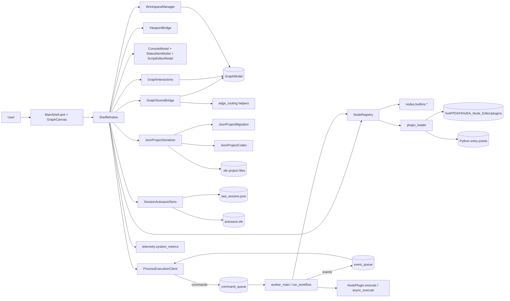
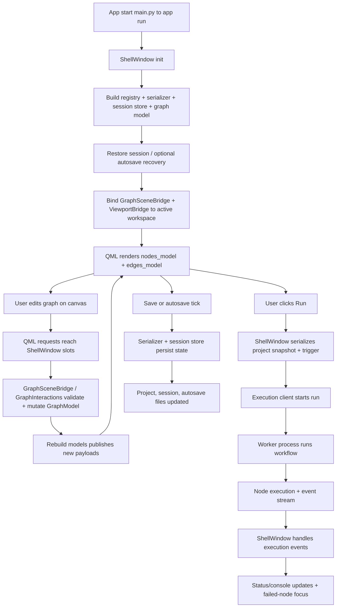
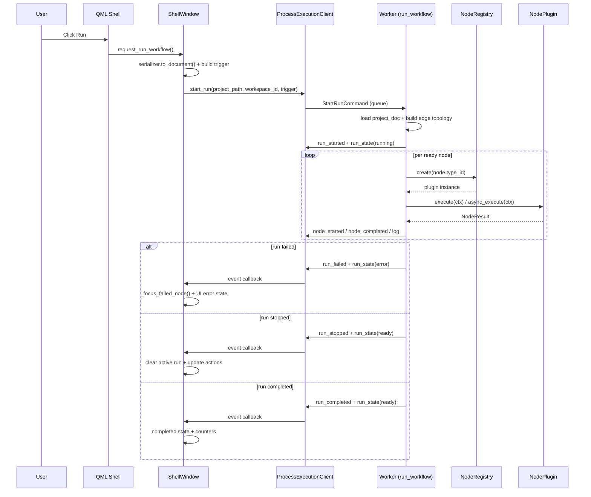

# EA Node Editor Architecture (Plain English)

## Purpose of this document
This file explains how the EA Node Editor codebase is structured and how data moves through the app at runtime.
It is intended as a practical map for engineers making changes.

## What this app does
EA Node Editor is a desktop visual workflow editor that:
- lets users build node graphs on a QML canvas,
- executes workflows in a separate worker process,
- persists projects as versioned `.sfe` JSON,
- supports plugin-based custom node types,
- restores sessions/autosaves and reports runtime status/metrics.

## Big picture
The app is split into clear parts:

- `ea_node_editor/ui` + `ea_node_editor/ui_qml`: shell window, QML scene, bridges, editor/status models.
- `ea_node_editor/graph`: in-memory graph domain (`ProjectData`, `WorkspaceData`, nodes, edges, views) plus wiring rules.
- `ea_node_editor/nodes`: node SDK contracts, registry, built-ins, plugin discovery, package import/export.
- `ea_node_editor/execution`: UI client + worker process + typed command/event protocol.
- `ea_node_editor/persistence`: schema migration, codec, serializer, session/autosave store.
- `ea_node_editor/workspace`: workspace ordering/lifecycle manager.
- `ea_node_editor/telemetry`: system metrics and performance benchmark harness.

Design intent:
- QML renders and captures interaction.
- `ShellWindow` orchestrates state transitions and cross-module calls.
- `GraphModel` remains the canonical mutable graph state.
- Worker process runs node execution and streams events back.
- Serializer/migration keeps persisted projects stable across schema versions.

## Visual architecture maps
If your Markdown viewer supports Mermaid, these diagrams render inline.

Static exports are generated into `docs/architecture_diagrams/`.
To regenerate diagrams:

```bash
python3 scripts/export_architecture_diagrams.py
```

### 1) Component map (who talks to whom)


### 2) Runtime pipeline (startup, edit, run, persist)


### 3) One workflow run as a sequence


## Startup flow
1. `main.py` calls `ea_node_editor.app.run()`.
2. `run()` creates `QApplication`, applies theme stylesheet, instantiates `ShellWindow`.
3. `ShellWindow` builds:
- `NodeRegistry` via `build_default_registry()` (built-ins + discovered plugins),
- serializer/session store (`JsonProjectSerializer`, `SessionAutosaveStore`),
- `GraphModel` + `WorkspaceManager`,
- QML bridges/models (`GraphSceneBridge`, `ViewportBridge`, console/status/script/workspace models),
- execution client (`ProcessExecutionClient`) and event subscription.
4. QML shell is loaded (`ui_qml/MainShell.qml`) with context properties.
5. Session restore + optional autosave recovery runs, then active workspace/view are bound.

## Main runtime flows
### 1) Graph editing and view sync
- QML invokes `request_*` slots on `ShellWindow`.
- Shell delegates graph mutations to `GraphSceneBridge` and `GraphInteractions`.
- Domain state changes are applied to `GraphModel`.
- `GraphSceneBridge._rebuild_models()` publishes normalized `nodes_model`/`edges_model` for QML.

### 2) Workflow execution
- `ShellWindow._run_workflow()` creates a document snapshot and starts `ProcessExecutionClient`.
- Client sends typed commands (`StartRunCommand`, pause/resume/stop) through multiprocessing queues.
- Worker executes `run_workflow()`:
- loads project snapshot,
- builds execution/data dependency maps,
- executes node plugins via registry,
- emits typed events (`run_state`, `node_started`, `node_completed`, `log`, terminal events).

### 3) Failure and cancellation behavior
- If a node raises and has `failed` downstream edges, worker routes control there.
- If a node raises without failure handlers, run emits `run_failed` and stops.
- Stop/pause/resume commands are handled by `_RunControl`.
- Long-running nodes can register cancel callbacks via `ExecutionContext.register_cancel`.

### 4) Persistence and recovery
- Save path uses `JsonProjectSerializer.save()` (deterministic ordering + schema normalization).
- Autosave/session persistence is periodic via `SessionAutosaveStore`.
- On startup, app restores session state and can recover a newer autosave snapshot.

## Data contracts that keep modules decoupled
- Graph domain dataclasses:
- `ProjectData`, `WorkspaceData`, `ViewState`, `NodeInstance`, `EdgeInstance`.
- Node SDK contracts:
- `NodeTypeSpec`, `PortSpec`, `PropertySpec`, `ExecutionContext`, `NodeResult`.
- Execution protocol contracts:
- commands (`StartRunCommand`, `StopRunCommand`, `PauseRunCommand`, `ResumeRunCommand`, `ShutdownCommand`),
- events (`RunStartedEvent`, `RunStateEvent`, `NodeStartedEvent`, `NodeCompletedEvent`, `RunCompletedEvent`, `RunFailedEvent`, `RunStoppedEvent`, `LogEvent`, `ProtocolErrorEvent`).
- Persistence contract:
- schema-versioned `.sfe` JSON (`SCHEMA_VERSION = 2`) migrated before model construction.

## Key architecture rules currently enforced
1. UI responsiveness through process isolation
- Workflows execute in a dedicated worker process, not the UI thread.

2. Explicit port compatibility
- Wiring enforces direction, kind compatibility, and single-target-input constraints.

3. Registry-controlled node contracts
- Node definitions are validated on registration; runtime property values are normalized.

4. Queue-boundary protocol typing
- Dataclasses are canonical in runtime; queues carry dict payloads only at boundaries.

5. Deterministic persistence with migration
- Documents are normalized/migrated before decoding; save output is stable and diff-friendly.

## Folder map
- `main.py`: launcher.
- `ea_node_editor/app.py`: Qt app bootstrap.
- `ea_node_editor/ui/shell/window.py`: top-level orchestrator and QML bridge surface.
- `ea_node_editor/ui_qml/`: QML UI and Python bridge/state models.
- `ea_node_editor/graph/`: graph datamodel and wiring rules.
- `ea_node_editor/nodes/`: SDK, registry, built-ins, plugin/package support.
- `ea_node_editor/execution/`: client/worker protocol and run engine.
- `ea_node_editor/persistence/`: migration, codec, serializer, autosave/session.
- `ea_node_editor/workspace/`: workspace ordering/lifecycle.
- `ea_node_editor/telemetry/`: metrics and performance harness.
- `tests/`: unit/integration coverage.

## Where to change what
- Add new built-in node behavior: `ea_node_editor/nodes/builtins/*.py`.
- Add plugin loading source/rules: `ea_node_editor/nodes/plugin_loader.py`.
- Change graph wiring rules: `ea_node_editor/graph/rules.py`.
- Change execution semantics or event behavior: `ea_node_editor/execution/worker.py` and `execution/protocol.py`.
- Change run orchestration/UI reaction: `ea_node_editor/ui/shell/window.py`.
- Change persistence schema normalization/migration: `ea_node_editor/persistence/migration.py`.
- Change QML canvas rendering/interaction: `ea_node_editor/ui_qml/components/GraphCanvas.qml` + `ui_qml/graph_scene_bridge.py`.

## Practical summary
EA Node Editor uses a QML-first UI with a Python orchestration shell, a strict node registry/port contract, and a process-isolated execution engine.
This split keeps concerns clear:
- UI and interaction in QML/bridges,
- canonical project graph in `GraphModel`,
- executable behavior in node plugins and worker,
- durable compatibility through serializer + migration layers.
