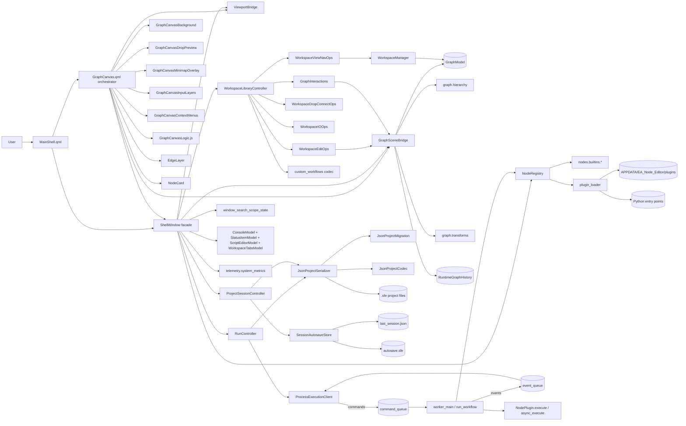
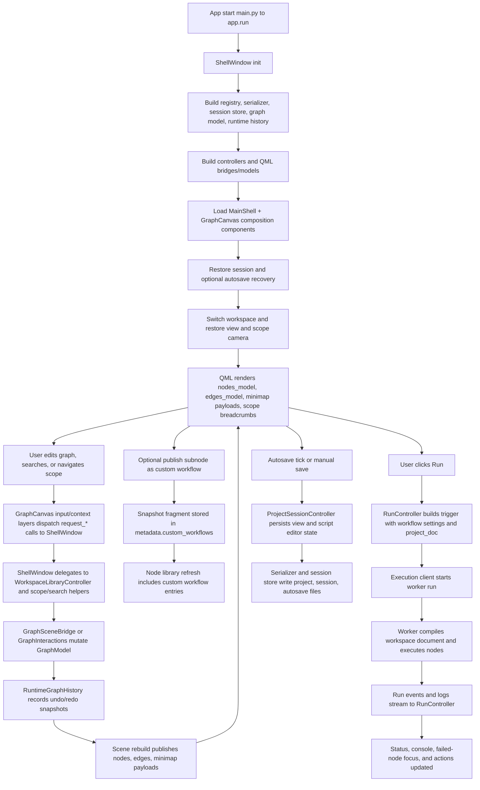
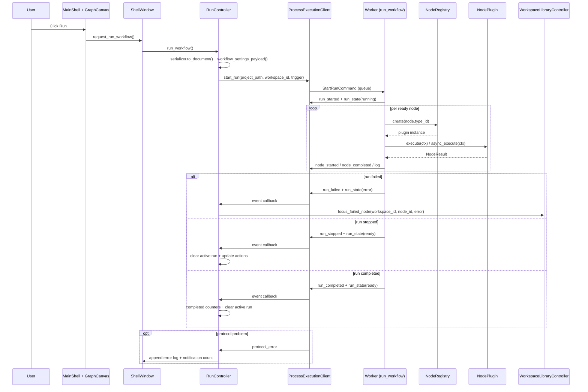

# EA Node Editor Architecture (Plain English)

## Purpose of this document
This file explains how EA Node Editor is structured, how runtime data moves through the app, and where to make changes safely.
It is a practical map for engineers working in this repository.

## What this app does
EA Node Editor is a desktop visual workflow editor that:
- lets users build node graphs on a QML canvas,
- supports nested subnode scopes (graph hierarchy),
- executes workflows in a separate worker process,
- persists projects as versioned `.sfe` JSON,
- supports plugin-based custom node types,
- publishes/imports reusable custom workflow snapshots,
- restores sessions/autosaves and reports runtime status/metrics.

## Big picture
The app is split into clear parts:

- `ea_node_editor/ui` + `ea_node_editor/ui_qml`: shell window, QML shell/canvas composition, bridges, and UI models.
- `ea_node_editor/ui/shell/controllers`: orchestration split into run, project/session, and workspace/library controllers.
- `ea_node_editor/graph`: in-memory graph domain (`ProjectData`, `WorkspaceData`, nodes, edges, views), hierarchy helpers, and graph transforms.
- `ea_node_editor/nodes`: node SDK contracts, registry, built-ins, plugin discovery, and package import/export.
- `ea_node_editor/execution`: UI client + worker process + typed command/event protocol.
- `ea_node_editor/persistence`: migration, codec, serializer, and session/autosave storage.
- `ea_node_editor/custom_workflows`: custom workflow metadata codec and `.eawf` import/export.
- `ea_node_editor/workspace`: workspace ordering and lifecycle manager.
- `ea_node_editor/telemetry`: system metrics.

Design intent:
- QML renders and captures interaction.
- `GraphCanvas.qml` composes focused canvas modules (`GraphCanvasBackground`, `GraphCanvasDropPreview`, `GraphCanvasMinimapOverlay`, `GraphCanvasInputLayers`, `GraphCanvasContextMenus`) plus `GraphCanvasLogic.js`.
- `ShellWindow` is a thin facade that delegates to controllers and bridge helpers.
- `GraphModel` remains the canonical mutable graph state.
- Hierarchy is explicit via `NodeInstance.parent_node_id` and per-view `scope_path`.
- Undo/redo is managed by `RuntimeGraphHistory` snapshots.
- Worker process runs node execution and streams events back.
- Serializer/migration keeps persisted projects stable across schema upgrades.

## Visual architecture maps
If your Markdown viewer supports Mermaid, these diagrams render inline.

Static exports are generated into `docs/architecture_diagrams/`.
To regenerate diagrams:

```bash
python3 scripts/export_architecture_diagrams.py
```

### 1) Component map (who talks to whom)


### 2) Runtime pipeline (startup, edit, run, persist)


### 3) One workflow run as a sequence


## Startup flow
1. `main.py` calls `ea_node_editor.app.run()`.
2. `run()` creates `QApplication`, applies theme stylesheet, instantiates `ShellWindow`.
3. `ShellWindow` builds:
- `NodeRegistry` via `build_default_registry()` (built-ins + discovered plugins),
- serializer/session store (`JsonProjectSerializer`, `SessionAutosaveStore`),
- `GraphModel` + `WorkspaceManager` + `RuntimeGraphHistory`,
- controller layer (`WorkspaceLibraryController`, `ProjectSessionController`, `RunController`),
- QML bridges/models (`GraphSceneBridge`, `ViewportBridge`, console/status/script/workspace models),
- execution client (`ProcessExecutionClient`) and event subscription.
4. QML shell is loaded (`ui_qml/MainShell.qml`) with context properties and a composed `GraphCanvas` surface.
5. `GraphCanvas` composes dedicated background/minimap/input/context/drop-preview modules.
6. Session restore + optional autosave recovery runs, then active workspace/view/scope are bound.

## Main runtime flows
### 1) Graph editing, hierarchy, and view sync
- `GraphCanvasInputLayers`, `NodeCard`, and `EdgeLayer` capture pointer/keyboard interactions and issue `request_*` calls.
- Shell delegates edits/navigation to `WorkspaceLibraryController` and helper ops.
- `GraphSceneBridge` applies scoped mutations to `GraphModel` (only nodes in active scope).
- Scope breadcrumbs and per-view `scope_path` are updated and persisted.
- `RuntimeGraphHistory` records snapshots for undo/redo.
- `GraphCanvasBackground`, `GraphCanvasDropPreview`, and `GraphCanvasMinimapOverlay` repaint from bridge payloads.

### 2) Search and scope navigation
- Graph search is orchestrated in `window_search_scope_state`.
- Search results can jump across workspaces, reveal collapsed parent chains, and focus/center selected nodes.
- Scope camera (zoom/pan) is remembered per workspace/view/scope tuple.

### 3) Custom workflow lifecycle
- Subnode scopes can be published into `metadata.custom_workflows` as reusable fragment snapshots.
- Custom workflows appear in the node library and can be dropped like node types.
- `.eawf` import/export is handled in `custom_workflows.file_codec` + workspace IO ops.

### 4) Workflow execution
- `RunController.run_workflow()` serializes a project snapshot and starts `ProcessExecutionClient`.
- Client sends typed commands through multiprocessing queues.
- Worker executes `run_workflow()`:
- compiles the selected workspace document,
- creates node plugins from registry,
- executes sync/async node logic,
- emits typed events (`run_state`, `node_started`, `node_completed`, `log`, terminal events).
- On failure, UI focuses the failed node path and updates run state/counters.

### 5) Persistence and recovery
- Save path uses `JsonProjectSerializer.save()` (deterministic ordering + schema normalization).
- Autosave/session persistence is periodic via `SessionAutosaveStore`.
- Startup restore can recover a newer autosave snapshot.
- View state and script editor UI state are persisted in project metadata.

## Data contracts that keep modules decoupled
- Graph domain dataclasses:
- `ProjectData`, `WorkspaceData`, `ViewState`, `NodeInstance`, `EdgeInstance`.
- Hierarchy fields:
- `NodeInstance.parent_node_id`, `ViewState.scope_path`.
- Node SDK contracts:
- `NodeTypeSpec`, `PortSpec`, `PropertySpec`, `ExecutionContext`, `NodeResult`.
- Execution protocol contracts:
- commands (`StartRunCommand`, `StopRunCommand`, `PauseRunCommand`, `ResumeRunCommand`, `ShutdownCommand`),
- events (`RunStartedEvent`, `RunStateEvent`, `NodeStartedEvent`, `NodeCompletedEvent`, `RunCompletedEvent`, `RunFailedEvent`, `RunStoppedEvent`, `LogEvent`, `ProtocolErrorEvent`).
- Persistence contract:
- schema-versioned `.sfe` JSON (`SCHEMA_VERSION = 3`) migrated before model construction.
- Custom workflow contract:
- `metadata.custom_workflows` plus `.eawf` import/export document format.
- QML canvas composition contract:
- `GraphCanvas.qml` remains the orchestration surface exposing `toggleMinimapExpanded()`, `clearLibraryDropPreview()`, `updateLibraryDropPreview()`, `isPointInCanvas()`, and `performLibraryDrop()`.

## Key architecture rules currently enforced
1. UI responsiveness through process isolation
- Workflows execute in a dedicated worker process, never on the UI thread.

2. Scope-safe graph edits
- Active scope controls visible/editable nodes and allowable connections.

3. Registry-controlled node contracts
- Node definitions are validated on registration; runtime property values are normalized.

4. Queue-boundary protocol typing
- Dataclasses are canonical in runtime; queues carry dict payloads only at boundaries.

5. Deterministic persistence with migration
- Documents are normalized/migrated before decode; save output is stable and diff-friendly.

6. Workspace-local undo/redo snapshots
- `RuntimeGraphHistory` tracks undo/redo stacks per workspace.

## Folder map
- `main.py`: launcher.
- `ea_node_editor/app.py`: Qt app bootstrap.
- `ea_node_editor/ui/shell/window.py`: QMainWindow/QML facade and slot surface.
- `ea_node_editor/ui/shell/controllers/`: run/project-session/workspace-library orchestration + ops.
- `ea_node_editor/ui/shell/window_search_scope_state.py`: graph search/scope camera/snap state helpers.
- `ea_node_editor/ui_qml/`: QML shell/canvas UI and Python bridge/state models.
- `ea_node_editor/ui_qml/components/shell/`: modular shell composition components extracted from `MainShell.qml`.
- `ea_node_editor/ui_qml/components/graph_canvas/`: modular GraphCanvas layers/overlays/helpers.
- `ea_node_editor/ui_qml/components/graph/`: node cards and edge rendering delegates.
- `ea_node_editor/graph/`: graph datamodel, hierarchy helpers, transforms, and wiring rules.
- `ea_node_editor/nodes/`: SDK, registry, built-ins, plugin/package support.
- `ea_node_editor/execution/`: client/worker protocol and run engine.
- `ea_node_editor/persistence/`: migration, codec, serializer, autosave/session.
- `ea_node_editor/custom_workflows/`: custom workflow metadata/file codecs.
- `ea_node_editor/workspace/`: workspace ordering/lifecycle.
- `ea_node_editor/telemetry/`: metrics.
- `tests/`: unit/integration coverage.

## Where to change what
- Add new built-in node behavior: `ea_node_editor/nodes/builtins/*.py`.
- Add plugin loading sources/rules: `ea_node_editor/nodes/plugin_loader.py`.
- Change graph hierarchy/scope behavior: `ea_node_editor/graph/hierarchy.py` and `ea_node_editor/ui_qml/graph_scene_bridge.py`.
- Change grouping/ungrouping and fragment transforms: `ea_node_editor/graph/transforms.py`.
- Change execution semantics or event behavior: `ea_node_editor/execution/worker.py` and `ea_node_editor/execution/protocol.py`.
- Change run orchestration/UI reaction: `ea_node_editor/ui/shell/controllers/run_controller.py`.
- Change project/session/autosave orchestration: `ea_node_editor/ui/shell/controllers/project_session_controller.py`.
- Change workspace/view/library/search behavior: `ea_node_editor/ui/shell/controllers/workspace_library_controller.py` and helper ops.
- Change shell QML composition layout: `ea_node_editor/ui_qml/MainShell.qml` and `ea_node_editor/ui_qml/components/shell/*`.
- Change custom workflow metadata/file format: `ea_node_editor/custom_workflows/codec.py` and `file_codec.py`.
- Change persistence schema normalization/migration: `ea_node_editor/persistence/migration.py`.
- Change QML canvas rendering/interaction: `ea_node_editor/ui_qml/components/GraphCanvas.qml`, `ui_qml/components/graph_canvas/*`, and `ui_qml/graph_scene_bridge.py`.

## Practical summary
EA Node Editor uses a QML-first UI with a Python shell facade, controller-based orchestration, scoped graph hierarchy, and a process-isolated execution engine.
This split keeps concerns clear:
- interaction/rendering in QML and bridges,
- canonical project state in `GraphModel`,
- orchestration in shell controllers,
- executable behavior in node plugins and worker,
- durable compatibility through serializer + migration layers.
