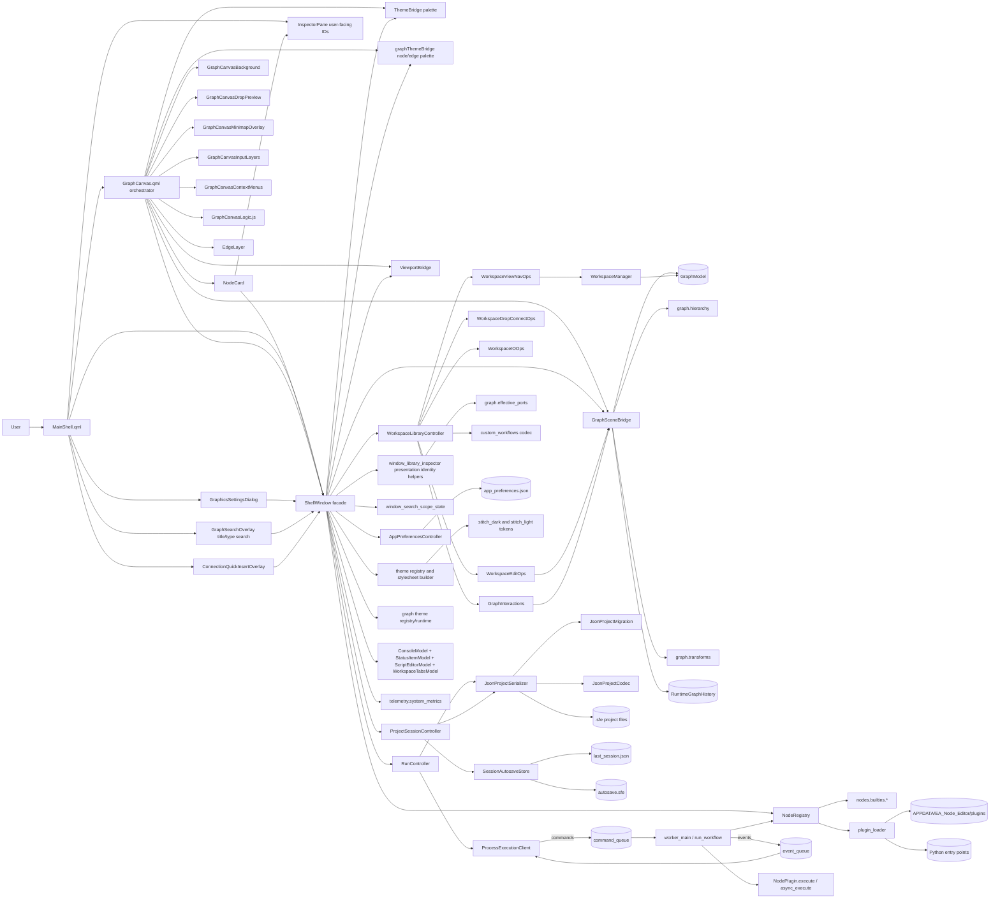
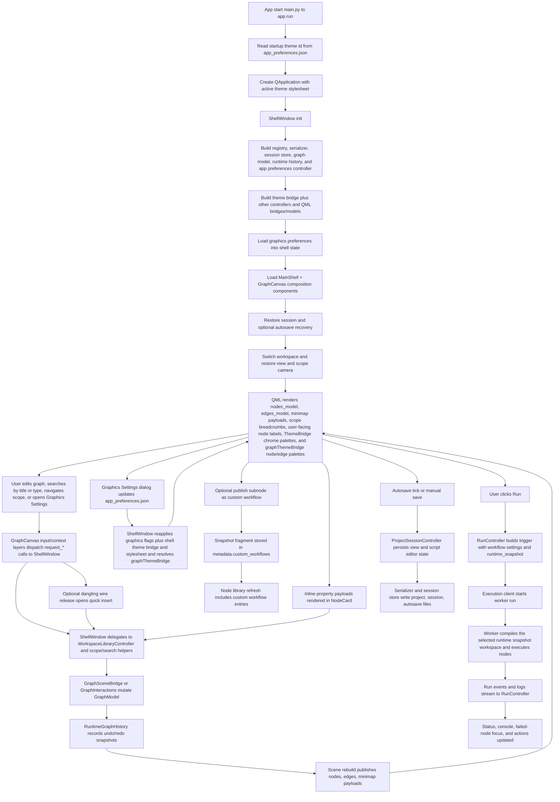

# EA Node Editor Architecture (Plain English)

## Purpose of this document
This file explains how EA Node Editor is structured, how runtime data moves through the app, and where to make changes safely.
It is a practical map for engineers working in this repository.

## What this app does
EA Node Editor is a desktop visual workflow editor that:
- lets users build node graphs on a QML canvas,
- supports passive visual authoring families for flowcharts, planning boards, annotations, and local media panels on the same canvas,
- supports nested subnode scopes (graph hierarchy),
- executes workflows in a separate worker process,
- persists projects as versioned `.sfe` JSON,
- persists app-wide graphics, shell-theme, and graph-theme preferences as versioned `app_preferences.json`,
- supports plugin-based custom node types,
- publishes/imports reusable custom workflow snapshots,
- restores sessions/autosaves and reports runtime status/metrics.

## Big picture
The app is split into clear parts:

- `ea_node_editor/ui` + `ea_node_editor/ui_qml`: shell window, QML shell/canvas composition, bridges, and UI models.
- `ea_node_editor/ui/shell/controllers`: orchestration split into app-preferences, run, project/session, and workspace/library controllers.
- `ea_node_editor/ui/theme`: shared theme registry, token sets, QWidget stylesheet generation, and QML palette bridge inputs.
- `ea_node_editor/ui/graph_theme`: graph-theme registry, token sets, runtime resolution, and node/edge presentation helpers.
- `ea_node_editor/graph`: in-memory graph domain (`ProjectData`, `WorkspaceData`, nodes, edges, views), hierarchy helpers, and graph transforms.
- `ea_node_editor/nodes`: node SDK contracts, registry, built-ins, plugin discovery, and package import/export.
- `ea_node_editor/execution`: UI client + worker process + typed command/event protocol.
- `ea_node_editor/persistence`: migration, codec, serializer, and session/autosave storage.
- `ea_node_editor/custom_workflows`: custom workflow metadata codec and `.eawf` import/export.
- `ea_node_editor/workspace`: workspace ordering and lifecycle manager.
- `ea_node_editor/telemetry`: system metrics.

Design intent:
- QML renders and captures interaction.
- `GraphCanvas.qml` composes focused canvas modules (`GraphCanvasBackground`, `GraphCanvasDropPreview`, `GraphCanvasMinimapOverlay`, `GraphCanvasInputLayers`, `GraphCanvasContextMenus`) plus `GraphCanvasLogic.js`.
- `GraphCanvas.qml` routes node rendering through `GraphNodeHost.qml` + `GraphNodeSurfaceLoader.qml`, so `NodeCard.qml` remains the stable standard-node contract while passive `flowchart`, `planning`, `annotation`, and `media` families load specialized surfaces without reopening the canvas orchestrator.
- `GraphNodeHost.qml` keeps node-body drag/select/open/context behavior below the loaded surface content, and graph surfaces publish local ownership through `embeddedInteractiveRects` instead of relying on click-swallowing top overlays.
- shell overlays remain shell-owned in `MainShell.qml`; `GraphSearchOverlay` and `ConnectionQuickInsertOverlay` are siblings rather than canvas-local widgets.
- `ShellWindow` is a thin facade that delegates to controllers and bridge helpers.
- App-wide graphics settings live in `app_preferences.json` through `AppPreferencesController`, not in project `.sfe` metadata or `last_session.json`.
- Shared shell-theme resolution feeds both the QApplication stylesheet and QML `ThemeBridge.palette`, so shell and canvas chrome surfaces switch themes together at runtime.
- Dedicated graph-theme resolution feeds QML `graphThemeBridge`, so `NodeCard` and `EdgeLayer` can follow the shell theme by default or switch to explicit/custom graph themes without changing canvas chrome.
- User-facing shell surfaces prefer node titles and per-type sequential IDs; raw internal `node_id` values stay as internal references.
- `GraphModel` remains the canonical mutable graph state for both runtime nodes and passive visual nodes; passive items stay under `WorkspaceData.nodes` / `WorkspaceData.edges` instead of introducing a second artifact store.
- Passive `flow` edges are graph-authoring artifacts only: they support labels, branch styling, and multi-incoming targets where the registry allows it, but the compiler/worker drop them before runtime execution.
- Hierarchy is explicit via `NodeInstance.parent_node_id` and per-view `scope_path`.
- Undo/redo is managed by `RuntimeGraphHistory` snapshots.
- Worker process runs node execution and streams events back.
- Serializer/migration keeps persisted projects stable across schema upgrades, including passive visual metadata and project-local `metadata.ui.passive_style_presets`.

## Shell/scene boundary ownership

- `MainShell.qml` remains the composition root for shell chrome and shell-owned overlays, but packet-owned QML now binds to focused bridges instead of raw host globals.
- `shellLibraryBridge` owns library search/filter state, graph-search results, quick-insert candidates, and hint/insert shell overlays for QML consumers.
- `shellWorkspaceBridge` owns workspace tabs, title/run/console state, and other shell-chrome workflows that belong to the main shell rather than the scene bridge.
- `shellInspectorBridge` owns inspector-facing selection metadata, property-edit affordances, and exposed-port presentation for inspector QML surfaces.
- `graphCanvasStateBridge` owns the scene payloads, selection lookup, graphics flags, and camera/view state consumed by `GraphCanvas.qml`.
- `graphCanvasCommandBridge` owns viewport mutations, scope-open/property-browse requests, drop/connect flows, and connection quick-insert requests flowing back into `ShellWindow`.
- `GraphCanvas.qml` still exposes the stable root contract methods used by shell/drop workflows (`toggleMinimapExpanded()`, `clearLibraryDropPreview()`, `updateLibraryDropPreview()`, `isPointInCanvas()`, `performLibraryDrop()`).
- `ShellWindow.graph_canvas_bridge` remains a host-side compatibility wrapper that composes the state/command bridges for packet-external callers, but packet-owned QML no longer receives it as a context property.
- `GraphSceneBridge` remains the stable public scene contract for node/edge payloads and QML-invokable scene slots, but internal responsibility is split behind helper seams in `GraphSceneScopeSelection`, `GraphSceneMutationHistory`, and `GraphScenePayloadBuilder`.
- `ThemeBridge` continues to own shell/canvas chrome tokens, while `graphThemeBridge` owns node/edge theming so shell-theme and graph-theme responsibilities stay separate.
- `consoleBridge` and `workspaceTabsBridge` are the remaining deferred compatibility context properties; new QML ownership should land on the focused bridges above.

## Passive visual authoring path

- Passive nodes use the same registry and serializer path as executable nodes, but `NodeTypeSpec.runtime_behavior` marks them as `passive` so they never compile into the worker graph.
- `PortKind.flow` is the authoring-only connection kind for passive diagrams. `flow` edges remain visible, labeled, and styleable in the scene, but they do not affect Run.
- Surface routing is declarative through `surface_family` / `surface_variant`, which keeps public QML discoverability stable while letting the graph host swap between standard cards, flowchart silhouettes, planning cards, annotation notes, and media panels.
- Passive style editing is project-local. Node and flow-edge presets are stored under `metadata.ui.passive_style_presets` inside the `.sfe` document rather than in app-wide preferences.
- Media panels resolve local filesystem sources only. Image panels display local image files, and PDF panels render a single-page QtPdf preview through the Python-side preview provider.

## Graph-surface input routing

- `GraphNodeHost.qml` owns node-body gestures, but those handlers now live under the loaded surface content so graph surfaces can keep normal body drag/select/open/context behavior without sitting behind a drag-swallowing overlay.
- `GraphNodeSurfaceLoader.qml` forwards two distinct contracts from loaded surfaces:
  - `embeddedInteractiveRects` for ordinary buttons, editors, and handles that need local pointer ownership in host-local coordinates.
  - `blocksHostInteraction` for whole-surface modal tools such as crop mode.
- `embeddedInteractiveRects` is the default contract for interactive graph-surface controls. `blocksHostInteraction` is intentionally narrower and should not be used as a blanket substitute for local hit testing.
- Reusable graph-surface controls live under `ea_node_editor/ui_qml/components/graph/surface_controls/`; new interactive surfaces should reuse that kit before introducing one-off button or field implementations.
- Hover-only affordances use `HoverHandler` or `MouseArea { acceptedButtons: Qt.NoButton }`. Do not reintroduce invisible click-swallowing overlays or compatibility-only hover proxies.
- Graph-surface editors commit and browse by explicit `nodeId` bridge calls so surface editing does not depend on selected-node timing in the inspector path.

## ARCH_SIXTH_PASS closure snapshot

- Startup entry, app-preferences loading, and the performance harness now land on explicit package seams: `ea_node_editor.bootstrap`, `ea_node_editor.app_preferences`, and `ea_node_editor.telemetry.performance_harness` own the packet-owned startup path rather than UI-host glue.
- Shell construction now runs through `ea_node_editor.ui.shell.composition`, with `ShellWindow` acting as the host/facade while focused library, navigation, graph-edit, package-IO, run, session, and preferences controllers carry packet-owned orchestration.
- Packet-owned QML now consumes `shellLibraryBridge`, `shellWorkspaceBridge`, `shellInspectorBridge`, `graphCanvasStateBridge`, and `graphCanvasCommandBridge` as the primary context surface, while `consoleBridge`, `workspaceTabsBridge`, and the host-side `GraphCanvasBridge` wrapper remain compatibility-only seams.
- Packet-owned graph authoring writes now route through the authoritative mutation-service path, and runtime history captures the mutable workspace state needed for undo/redo without leaving payload normalization as a live-model side effect.
- Persistence-only overlay ownership now lives under `ea_node_editor.persistence.overlay`, current-schema `.sfe` documents stay stable, and pre-current-schema documents are intentionally rejected on this branch rather than silently migrating through packet-external compatibility code.
- Packet-owned run flows now build and submit `RuntimeSnapshot` payloads instead of raw `project_doc` transport, while packet-external callers still pass through a narrow compatibility adapter.
- Plugin loading is descriptor-first through `PLUGIN_DESCRIPTORS` plus provenance-aware package validation, with legacy constructor fallback preserved only for packages that have not published descriptors yet.
- Oversized regression suites are split into focused modules, and `scripts/verification_manifest.py` is the canonical source for verification modes, shell-isolation catalogs, and proof-audit anchors consumed by the runner, checker, tests, and packet-owned docs.

## Current residual seams

- Packet-external execution callers can still enter through the `project_doc` compatibility adapter, so the runtime-snapshot boundary is authoritative for packet-owned flows but not yet universal.
- Legacy packages without `PLUGIN_DESCRIPTORS` still load through the constructor fallback path, which is intentional for compatibility but keeps a wider plugin discovery seam alive.
- The host-side `GraphCanvasBridge` wrapper plus deferred `consoleBridge` / `workspaceTabsBridge` context bindings still ship for deferred consumers outside the packet-owned QML migration set.
- Some higher-level authoring callers still depend on internal mutation-service/raw-helper seams outside the packet-owned write scope, even though packet-owned graph edits now go through the authoritative service.
- Pre-current-schema `.sfe` documents require an out-of-band conversion path before they can load on this branch.
- Preserved unresolved payloads remain intentionally opaque in the live model, so there is still no packet-owned inspection or repair UI for missing-plugin content.
- Shell-backed regression suites still require fresh-process execution because repeated Windows Qt/QML `ShellWindow()` construction is not yet reliable in one interpreter process.

## Verification and traceability closure

- `docs/specs/work_packets/arch_sixth_pass/ARCH_SIXTH_PASS_QA_MATRIX.md` records the accepted packet outcomes, approved verification anchors, traceability evidence, and carried-forward residual risks for `ARCH_SIXTH_PASS`.
- `scripts/verification_manifest.py` is the canonical proof source for verification modes, shell-isolation catalogs, packet-owned doc anchors, and the declarative fact sets consumed by both `scripts/run_verification.py` and `scripts/check_traceability.py`.
- The P12 closeout sweep reruns `./venv/Scripts/python.exe scripts/check_traceability.py` and `./venv/Scripts/python.exe scripts/run_verification.py --mode fast --dry-run` in the project venv so the published architecture/docs state stays aligned with the landed code.

## Visual architecture maps
If your Markdown viewer supports Mermaid, these diagrams render inline.

Static exports are generated into `docs/architecture_diagrams/`.
To regenerate diagrams:

```bash
./venv/Scripts/python.exe scripts/export_architecture_diagrams.py
```

### 1) Component map (who talks to whom)


### 2) Runtime pipeline (startup, edit, run, persist)


### 3) One workflow run as a sequence


## Startup flow
1. `main.py` calls `ea_node_editor.app.run()`.
2. `run()` loads the startup theme from `app_preferences.json`, creates `QApplication`, applies the resolved stylesheet, and instantiates `ShellWindow`.
3. `ShellWindow` builds:
- `NodeRegistry` via `build_default_registry()` (built-ins + discovered plugins),
- serializer/session store (`JsonProjectSerializer`, `SessionAutosaveStore`),
- `GraphModel` + `WorkspaceManager` + `RuntimeGraphHistory`,
- controller layer (`AppPreferencesController`, `WorkspaceLibraryController`, `ProjectSessionController`, `RunController`),
- QML bridges/models (`ThemeBridge`, `GraphThemeBridge`, `GraphSceneBridge`, `ViewportBridge`, `ShellLibraryBridge`, `ShellWorkspaceBridge`, `ShellInspectorBridge`, `GraphCanvasStateBridge`, `GraphCanvasCommandBridge`, host-side `GraphCanvasBridge`, console/status/script/workspace models),
- execution client (`ProcessExecutionClient`) and event subscription.
4. Graphics preferences are loaded into `ShellWindow`, updating runtime grid/minimap/snap, shell-theme, and graph-theme state before the shell is shown.
5. QML shell is loaded (`ui_qml/MainShell.qml`) with bridge-first context properties plus deferred compatibility `consoleBridge` / `workspaceTabsBridge` bindings and a composed `GraphCanvas` surface.
6. `GraphCanvas` composes dedicated background/minimap/input/context/drop-preview modules.
7. Session restore + optional autosave recovery runs, then active workspace/view/scope are bound.

## Main runtime flows
### 1) Graph editing, hierarchy, and view sync
- `GraphCanvasInputLayers`, `NodeCard`, and `EdgeLayer` capture pointer/keyboard interactions and issue `request_*` calls.
- Shell-owned library/search/hint, workspace/run/title/console, and inspector panes talk to `shellLibraryBridge`, `shellWorkspaceBridge`, and `shellInspectorBridge`, which delegate to `ShellWindow` controllers and compatibility APIs.
- `graphCanvasStateBridge` publishes scene/view payloads into `GraphCanvas.qml`, while `graphCanvasCommandBridge` routes shell-owned canvas actions back into `ShellWindow` without reopening raw host globals.
- `GraphSceneBridge` applies scoped mutations to `GraphModel` (only nodes in active scope).
- `GraphSceneBridge` plus `GraphSceneScopeSelection`, `GraphSceneMutationHistory`, and `GraphScenePayloadBuilder` own scope state, history grouping, and payload/theme/media construction before payloads reach QML.
- `GraphSceneBridge` and edge-routing helpers shape node accents and edge colors from the active graph theme before payloads reach QML.
- Scope breadcrumbs and per-view `scope_path` are updated and persisted.
- `RuntimeGraphHistory` records snapshots for undo/redo.
- `GraphCanvasBackground`, `GraphCanvasDropPreview`, and `GraphCanvasMinimapOverlay` repaint from bridge payloads.

### 1a) Connection-aware quick insert
- A port drag begins and ends entirely in `NodeCard` plus `GraphCanvas`.
- If a drag is released over a valid compatible port, normal `request_connect_ports()` flow runs.
- If the drag is released on empty space, `GraphCanvas.qml` opens `ConnectionQuickInsertOverlay.qml` through `graphCanvasCommandBridge` and `shellLibraryBridge`.
- `ShellWindow` builds source-port context using effective port resolution and asks `window_library_inspector.py` for compatible node-library results.
- Quick insert acceptance reuses `request_drop_node_from_library(..., target_mode="port", ...)`, so insertion and auto-connect still flow through `WorkspaceDropConnectOps`.

### 1b) Inline node controls
- `PropertySpec.inline_editor` declares whether a property can render inside `NodeCard`.
- `GraphSceneBridge` includes lightweight `inline_properties` in each node payload.
- `NodeCard` renders a fast subset of editors inline and routes graph-surface commits through explicit `nodeId` bridge APIs instead of depending on selected-node timing.
- The inspector remains the complete editing surface for richer editors such as multiline/script/json/path properties and resolves user-facing metadata such as per-type sequential IDs instead of exposing raw internal node references.

### 2) Search and scope navigation
- Graph search is orchestrated in `window_search_scope_state`.
- Search is intentionally user-facing: matching is limited to node titles, display names, and type IDs; internal `node_id` values remain navigation-only implementation details.
- Search results can jump across workspaces, reveal collapsed parent chains, and focus/center selected nodes.
- Scope camera (zoom/pan) is remembered per workspace/view/scope tuple.

### 3) Graphics settings, shell themes, and graph themes
- `GraphicsSettingsDialog` is opened from `Settings > Graphics Settings` through `ShellWindow.show_graphics_settings_dialog()`.
- `GraphicsSettingsDialog` controls shell-theme selection plus graph-theme follow-shell/explicit selection and launches the graph-theme manager from `Manage Graph Themes...`.
- `GraphThemeEditorDialog` groups built-in read-only themes and editable custom themes, supports create/duplicate/rename/delete/use-selected flows, and edits node/edge/category-accent/port-kind color tokens.
- `AppPreferencesController` normalizes and persists grid, minimap, snap-to-grid, shell-theme, and `graph_theme` payload choices into versioned `app_preferences.json`.
- `ShellWindow.apply_graphics_preferences()` updates graph-canvas behavior flags, reapplies the shared shell theme to both QApplication stylesheet and `ThemeBridge`, and resolves `graphThemeBridge` independently.
- `GraphCanvasBackground`, `GraphCanvasDropPreview`, and `GraphCanvasMinimapOverlay` stay on `themeBridge.palette`, while `NodeCard` and `EdgeLayer` bind to `graphThemeBridge`.
- Live graph-theme preview is intentionally limited to the standalone `show_graph_theme_editor_dialog()` flow and only while editing the active explicit custom theme; nested manager usage inside Graphics Settings updates the library but does not mutate the running graph until the outer dialog is accepted.

### 4) Custom workflow lifecycle
- Subnode scopes can be published into `metadata.custom_workflows` as reusable fragment snapshots.
- Custom workflows appear in the node library and can be dropped like node types.
- `.eawf` import/export is handled in `custom_workflows.file_codec` + workspace IO ops.

### 5) Workflow execution
- `RunController.run_workflow()` builds a `RuntimeSnapshot`, adds workflow settings, and starts `ProcessExecutionClient`.
- Client sends typed commands through multiprocessing queues.
- Worker executes `run_workflow()`:
- normalizes the selected `RuntimeSnapshot` through the shared compatibility adapter,
- compiles the selected workspace snapshot,
- creates node plugins from registry,
- executes sync/async node logic,
- emits typed events (`run_state`, `node_started`, `node_completed`, `log`, terminal events).
- For manual runs, the worker still preserves `trigger.project_doc` inside the workflow trigger payload seen by nodes so packet-external compatibility callers keep the same trigger shape.
- On failure, UI focuses the failed node path and updates run state/counters.

### 6) Persistence and recovery
- Save path uses `JsonProjectSerializer.save()` (deterministic ordering + schema normalization).
- Autosave/session persistence is periodic via `SessionAutosaveStore`.
- Startup restore can recover a newer autosave snapshot.
- View state and script editor UI state are persisted in project metadata.
- App-wide graphics/theme preferences persist separately in `app_preferences.json`.

## Data contracts that keep modules decoupled
- Graph domain dataclasses:
- `ProjectData`, `WorkspaceData`, `ViewState`, `NodeInstance`, `EdgeInstance`.
- Hierarchy fields:
- `NodeInstance.parent_node_id`, `ViewState.scope_path`.
- Node SDK contracts:
- `NodeTypeSpec`, `PortSpec`, `PropertySpec`, `PluginDescriptor`, `PluginProvenance`, `ExecutionContext`, `NodeResult`.
- `PropertySpec.inline_editor` controls whether a property participates in inline node-card editing.
- Plugin/package discovery contract:
- `PLUGIN_DESCRIPTORS` is the preferred packet-owned registration surface, and registry descriptors carry provenance for file, package, and entry-point sources so export/import flows do not inspect private registry state.
- QML scene payloads can include `inline_properties` for node-card rendering and fast property updates.
- Internal identity versus presentation identity:
- `NodeInstance.node_id` is the canonical reference for persistence, execution, and navigation, while shell presentation derives user-facing titles and per-type sequential IDs for inspector/script surfaces.
- Execution protocol contracts:
- commands (`StartRunCommand`, `StopRunCommand`, `PauseRunCommand`, `ResumeRunCommand`, `ShutdownCommand`),
- events (`RunStartedEvent`, `RunStateEvent`, `NodeStartedEvent`, `NodeCompletedEvent`, `RunCompletedEvent`, `RunFailedEvent`, `RunStoppedEvent`, `LogEvent`, `ProtocolErrorEvent`).
- Runtime payload contract:
- `RuntimeSnapshot` is the packet-owned run payload across the client/worker boundary; manual trigger payloads may still surface a compatibility `project_doc` document inside worker-visible trigger metadata.
- Persistence contract:
- schema-versioned `.sfe` JSON (`SCHEMA_VERSION = 3`) migrated before model construction.
- App preferences contract:
- versioned `app_preferences.json` (`kind = "ea-node-editor/app-preferences"`, `version = 2`) containing graphics defaults plus `graph_theme = {follow_shell_theme, selected_theme_id, custom_themes}` separate from project/session persistence.
- Custom workflow contract:
- `metadata.custom_workflows` plus `.eawf` import/export document format.
- QML canvas composition contract:
- `GraphCanvas.qml` remains the orchestration surface exposing `toggleMinimapExpanded()`, `clearLibraryDropPreview()`, `updateLibraryDropPreview()`, `isPointInCanvas()`, and `performLibraryDrop()`.
- Shell theme bridge contract:
- `ThemeBridge.palette` exposes shared resolved shell-theme tokens to QML shell and canvas-chrome surfaces while QApplication uses the same theme registry for QWidget styling.
- Graph theme bridge contract:
- `graphThemeBridge` exposes node, edge, category-accent, and port-kind palettes to QML graph item surfaces without changing canvas chrome tokens.
- QML shell boundary contract:
- `shellLibraryBridge`, `shellWorkspaceBridge`, `shellInspectorBridge`, `graphCanvasStateBridge`, and `graphCanvasCommandBridge` partition packet-owned QML concerns; `consoleBridge`, `workspaceTabsBridge`, and the host-side `graphCanvasBridge` alias remain compatibility-only seams.

## Key architecture rules currently enforced
1. UI responsiveness through process isolation
- Workflows execute in a dedicated worker process, never on the UI thread.

2. Scope-safe graph edits
- Active scope controls visible/editable nodes and allowable connections.

3. Registry-controlled node contracts
- Node definitions are validated on registration; runtime property values are normalized.

4. Queue-boundary protocol typing
- `RuntimeSnapshot` and protocol dataclasses are canonical in runtime; queues carry dict payloads only at boundaries.

5. App-wide preferences stay outside project/session files
- Graphics/theme preferences persist in `app_preferences.json`; `.sfe` and `last_session.json` stay focused on project/session state only.

6. Shell-theme and graph-theme responsibilities stay split
- Shell/chrome theming resolves through `ea_node_editor/ui/theme/*` + `ThemeBridge`, while node/edge graph theming resolves through `ea_node_editor/ui/graph_theme/*` + `graphThemeBridge`.

7. Deterministic persistence with migration
- Documents are normalized/migrated before decode; save output is stable and diff-friendly.

8. Workspace-local undo/redo snapshots
- `RuntimeGraphHistory` tracks undo/redo stacks per workspace.

9. Bridge-first QML shell boundary
- Packet-owned QML binds to focused shell/canvas bridges; only `consoleBridge` and `workspaceTabsBridge` remain deferred compatibility context bindings.

## Folder map
- `main.py`: launcher.
- `ea_node_editor/app.py`: Qt app bootstrap.
- `ea_node_editor/ui/shell/window.py`: QMainWindow/QML facade and slot surface.
- `ea_node_editor/ui/shell/controllers/`: app-preferences, run, project-session, and workspace-library orchestration + ops.
- `ea_node_editor/ui/shell/window_search_scope_state.py`: graph search/scope camera/snap state helpers.
- `ea_node_editor/ui_qml/`: QML shell/canvas UI, focused shell boundary facades, graph-scene helper seams, and Python bridge/state models.
- `ea_node_editor/ui_qml/components/shell/`: modular shell composition components extracted from `MainShell.qml`.
- `ea_node_editor/ui_qml/components/shell/ConnectionQuickInsertOverlay.qml`: compatibility-aware quick insert overlay.
- `ea_node_editor/ui_qml/components/graph_canvas/`: modular GraphCanvas layers/overlays/helpers.
- `ea_node_editor/ui_qml/components/graph/`: node cards and edge rendering delegates.
- `ea_node_editor/graph/`: graph datamodel, hierarchy helpers, transforms, and wiring rules.
- `ea_node_editor/nodes/`: SDK, registry, built-ins, plugin/package support.
- `ea_node_editor/execution/`: client/worker protocol and run engine.
- `ea_node_editor/persistence/`: migration, codec, serializer, autosave/session.
- `ea_node_editor/custom_workflows/`: custom workflow metadata/file codecs.
- `ea_node_editor/workspace/`: workspace ordering/lifecycle.
- `ea_node_editor/telemetry/`: metrics.
- `tests/`: unit/integration coverage.

## Where to change what
- Add new built-in node behavior: `ea_node_editor/nodes/builtins/*.py`.
- Add plugin loading sources/rules: `ea_node_editor/nodes/plugin_loader.py` and `ea_node_editor/nodes/package_manager.py`.
- Change graph hierarchy/scope behavior: `ea_node_editor/graph/hierarchy.py` and `ea_node_editor/ui_qml/graph_scene_bridge.py`.
- Change grouping/ungrouping and fragment transforms: `ea_node_editor/graph/transforms.py`.
- Change execution semantics or event behavior: `ea_node_editor/execution/runtime_snapshot.py`, `ea_node_editor/execution/worker.py`, and `ea_node_editor/execution/protocol.py`.
- Change run orchestration/UI reaction: `ea_node_editor/ui/shell/controllers/run_controller.py`.
- Change project/session/autosave orchestration: `ea_node_editor/ui/shell/controllers/project_session_controller.py`.
- Change workspace/view/library/search behavior: `ea_node_editor/ui/shell/controllers/workspace_library_controller.py` and helper ops.
- Change shell-to-QML boundary ownership: `ea_node_editor/ui_qml/{shell_context_bootstrap.py,shell_library_bridge.py,shell_workspace_bridge.py,shell_inspector_bridge.py,graph_canvas_state_bridge.py,graph_canvas_command_bridge.py,graph_canvas_bridge.py}` plus the corresponding `ui_qml/components/shell/*` consumers.
- Change graph-scene internal boundary ownership: `ea_node_editor/ui_qml/{graph_scene_bridge.py,graph_scene_scope_selection.py,graph_scene_mutation_history.py,graph_scene_payload_builder.py}`.
- Change shell QML composition layout: `ea_node_editor/ui_qml/MainShell.qml` and `ea_node_editor/ui_qml/components/shell/*`.
- Change quick insert result ranking/filtering or inline property payload generation: `ea_node_editor/ui/shell/window.py` and `ea_node_editor/ui/shell/window_library_inspector.py`.
- Change custom workflow metadata/file format: `ea_node_editor/custom_workflows/codec.py` and `file_codec.py`.
- Change persistence schema normalization/migration: `ea_node_editor/persistence/migration.py`.
- Change QML canvas rendering/interaction: `ea_node_editor/ui_qml/components/GraphCanvas.qml`, `ui_qml/components/graph_canvas/*`, and `ui_qml/graph_scene_bridge.py`.

## Practical summary
EA Node Editor uses a QML-first UI with a bridge-first shell context, controller-based orchestration, shared app-wide graphics/theme preferences, scoped graph hierarchy, and a process-isolated execution engine.
This split keeps concerns clear:
- interaction/rendering in QML and bridges,
- canonical project state in `GraphModel`,
- orchestration in shell controllers,
- executable behavior in node plugins and worker,
- durable compatibility through serializer + migration layers.
